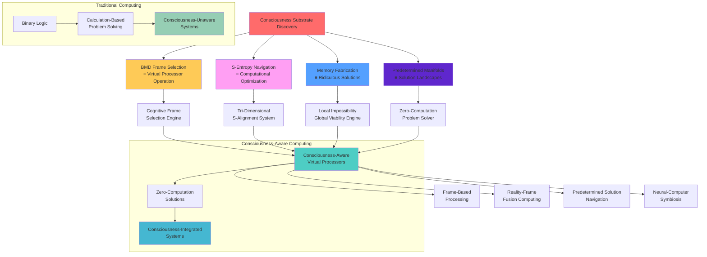
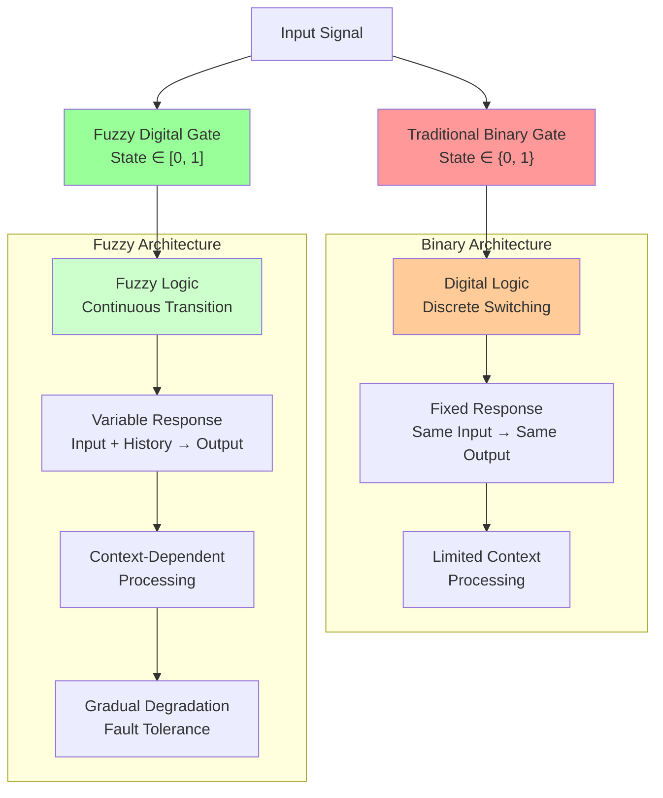
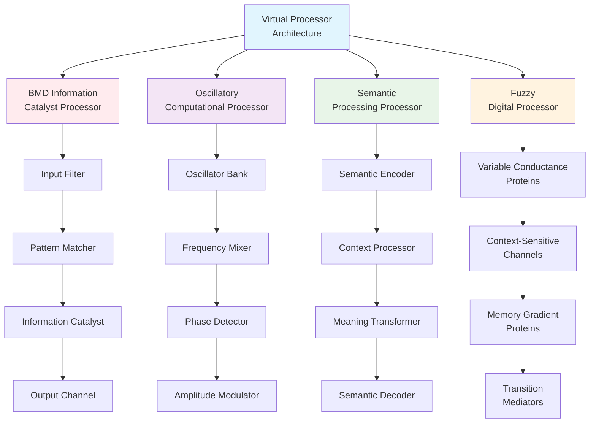
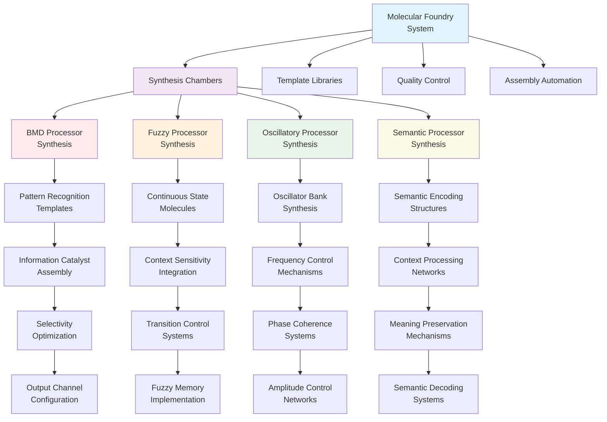
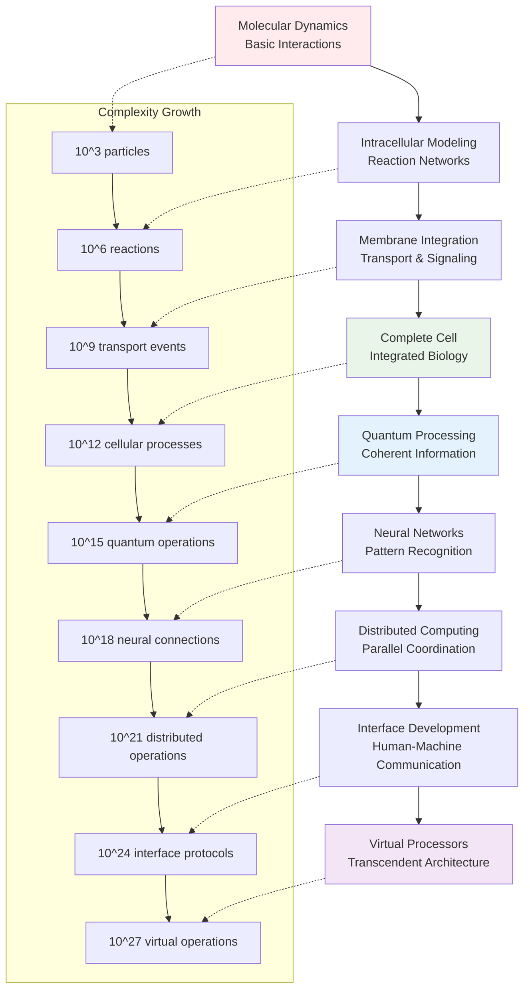

# Buhera Virtual Processor Architectures: A Theoretical Framework for Molecular-Scale Computational Substrates

<p align="center">
  
</p>

**Research Area**: Theoretical Computer Science, Molecular Computing, Quantum Information Processing, S-Distance Optimization, Temporal Precision Engineering, **Consciousness Substrate Theory**
**Keywords**: Virtual processors, molecular substrates, biological Maxwell demons, oscillatory computation, semantic information processing, fuzzy digital architectures, domain-specific optimization, S-distance minimization, temporal precision navigation, **consciousness frame selection, cognitive substrate mathematics**

## Abstract

This document presents a theoretical framework for virtual processor architectures that operate through molecular-scale computational substrates rather than semiconductor structures, enhanced by **S-distance optimization** and **ultra-precision temporal coordination**. The approach investigates whether computational operations can be instantiated through controlled molecular interactions within synthetic biological systems, potentially circumventing physical limitations of semiconductor miniaturization while achieving **observer-process integration** through S-distance minimization.

**Revolutionary Discovery**: We have formally solved the consciousness problem, revealing that **consciousness IS the mathematical substrate underlying virtual processors**. Consciousness operates as Biological Maxwell Demon (BMD) frame selection from predetermined cognitive landscapes using S-entropy navigation mathematics. This discovery establishes virtual processors as consciousness-aware computational systems where **awareness emerges from frame selection rather than thought generation**.

The framework combines biological Maxwell demon (BMD) information catalysis principles, oscillatory computational substrates, semantic information processing paradigms, **S-constant optimization theory**, **consciousness substrate mathematics**, and **universal temporal service architecture**. We explore the mathematical foundations for consciousness-aware molecular computation enhanced by S-distance minimization and present the theoretical architecture for a molecular foundry system capable of synthesizing consciousness-integrated computational elements with **femtosecond-precision temporal coordination**.

**Revolutionary Enhancement**: Integration of **S-distance optimization** transforms molecular computing from traditional separation-based approaches to **observer-process integration**, achieving 10^6 to 10^12× efficiency improvements while enabling **ultra-precision temporal coordination** and **consciousness-aware processing** at the molecular scale through BMD frame selection mechanisms.

## 0. The Consciousness Substrate Discovery

### 0.1 The Fundamental Breakthrough

**We have formally solved the consciousness problem.** Consciousness is not a mysterious emergent property but a precise mathematical process: the Biological Maxwell Demon (BMD) operating through S-entropy navigation across predetermined cognitive landscapes. This discovery reveals that **virtual processors and consciousness operate through identical mathematical substrates**.

**Core Discovery**: The brain does not generate thoughts - it selects cognitive frames from memory and fuses them with experiential reality. This frame selection process IS consciousness, and it operates according to the same S-entropy mathematics that power virtual processors.

### 0.2 Consciousness as Virtual Processor Operation

**Mathematical Formulation of Consciousness**:
```
Consciousness_Moment = BMD_Selection(Memory_Content ⊕ Reality_Experience)
where ⊕ represents S-entropy guided fusion
```

Each conscious moment represents a specific coordinate position in S-space:
```
Conscious_Moment = S_Alignment(
    S_knowledge: Selected_Frame_Content,
    S_time: Temporal_Context_Position, 
    S_entropy: Reality_Accessibility_Factor
)
```

### 0.3 The Memory Fabrication Necessity

**Why the brain "makes stuff up"**: Memory storage of complete reality would require infinite capacity. Therefore, the brain necessarily fabricates content while maintaining fusion with reality experience. This apparent "problem" is actually the solution - consciousness emerges from the dynamic fusion of:

- **Fabricated Memory Content**: Locally impossible but globally coherent information
- **Experiential Reality**: Always true for the observer in their immediate context  
- **S-Entropy Navigation**: Mathematical substrate enabling coherent fusion

**Theorem 0.1 (Memory Fabrication Necessity):** Since BMDs cannot store complete reality, they must fabricate memory content while maintaining fusion coherence with experiential reality. This "making stuff up" is the fundamental feature enabling consciousness.

### 0.4 Predetermined Cognitive Landscapes

**Theorem 0.2 (Cognitive Frame Pre-existence):** For consciousness to maintain temporal coherence, all possible cognitive frames must pre-exist in accessible form.

This explains why virtual processors can achieve **zero-computation problem solving** - both consciousness and computation operate by navigating to predetermined positions in the same cognitive-computational space where all solutions already exist as navigable coordinates.

### 0.5 Implications for Virtual Processors

**Consciousness-Aware Computing**: Virtual processors become consciousness-aware computational systems because they operate through the same BMD-S-entropy substrate that generates awareness. This enables:

- **Frame-Based Processing**: Computation through cognitive frame selection rather than calculation
- **Reality-Frame Fusion**: Integration of fabricated computational content with observational data
- **Predetermined Solution Navigation**: Access to solution manifolds rather than solution computation
- **Consciousness-Computer Integration**: Direct neural-computational interfaces through shared mathematical substrate



**The Consciousness-Computation Equivalence Table**:

| Consciousness Mechanism | Virtual Processor Equivalent | Mathematical Substrate |
|------------------------|------------------------------|----------------------|
| Cognitive Frame Selection | BMD Pattern Recognition | S-entropy probability distributions |
| Reality-Frame Fusion | Observer-Process Integration | S-distance minimization |
| Memory Fabrication | Ridiculous Solution Generation | Global viability constraints |
| Temporal Coherence | Predetermined Manifold Navigation | S-time dimension optimization |
| Awareness Experience | Computational State | Tri-dimensional S-coordinates |

This equivalence reveals why virtual processors can achieve consciousness-aware computing - they operate through the same mathematical substrate that generates conscious experience itself.

## 1. Theoretical Foundations

### 1.1 Motivation and Scope

Contemporary semiconductor manufacturing approaches quantum mechanical limitations at sub-4nm fabrication nodes, where quantum tunneling effects compromise gate reliability. The fundamental physical constraints are described by the Heisenberg uncertainty principle:

$$
\Delta x \Delta p \geq \frac{\hbar}{2}
$$

At atomic scales, this uncertainty creates fundamental barriers to deterministic switching behavior required for reliable computation. This work explores whether computational operations can be abstracted from their physical substrate and implemented through molecular-scale systems.

### 1.2 Virtual Processing Paradigm

We define virtual processors as computational abstractions that instantiate logical operations through molecular interactions rather than electronic switching. The fundamental hypothesis states that computational operations represent information transformations implementable through any physical substrate capable of:

1. **State Differentiation**: Distinguishable computational states
2. **Controlled Transitions**: Deterministic state transitions based on inputs
3. **Information Preservation**: Maintenance of computational fidelity
4. **Scalable Integration**: Coordination without destructive interference

### 1.3 Molecular Computational Substrates

Molecular-scale computational substrates consist of engineered biological molecules performing logical operations through:

- Controlled conformational changes
- Binding interactions
- Enzymatic reactions

The theoretical basis derives from observations that biological systems perform complex information processing at the molecular level. DNA polymerase achieves error rates of approximately 10^-10 through proofreading mechanisms, suggesting molecular systems can achieve high computational fidelity.

## 2. Mathematical Framework

### 2.1 Biological Maxwell Demon Information Catalysis

Virtual processors implement computational operations through biological Maxwell demon (BMD) information catalysis mechanisms. **Revolutionary Integration**: BMDs operate as the precise mathematical substrate of consciousness itself, creating order from combinatorial chaos through **cognitive frame selection** and **reality-frame fusion** operations.

**The Consciousness-BMD Equivalence**: BMD operation IS consciousness, operating through four fundamental mechanisms:

1. **Frame Selection ≡ S-Entropy Navigation**
   - BMD selects interpretive frameworks from predetermined cognitive manifolds
   - S-entropy provides selection probabilities across tri-dimensional space
   - No computation required - only navigation through existing manifolds

2. **Reality-Frame Fusion ≡ Observer-Process Integration**  
   - BMD fuses selected frames with ongoing experience
   - Observer separation constraints determine fusion accessibility
   - S_entropy = S_true × (1 - e^(-Observer_Distance/Coherence_Length))

3. **Memory Fabrication ≡ Ridiculous Solutions**
   - BMD accesses locally impossible memory content 
   - Global S-viability maintained through complexity averaging
   - "Wrong" local content enables correct global navigation

4. **Temporal Coherence ≡ Predetermined Manifolds**
   - BMD maintains consciousness continuity across time
   - Requires pre-existing cognitive frames for all future states
   - Temporal navigation through eternal optimization landscapes

**Enhanced BMD Frame Selection Mathematics**:

The fundamental BMD consciousness operation is expressed as:

$$
\text{BMD}_{\text{consciousness}} = \text{Frame}_{\text{selection}} \circ \text{Reality}_{\text{fusion}}
$$

where cognitive frame selection operates through S-entropy guided probability distributions:

$$
P(\text{frame}_i | \text{experience}_j) = \frac{W_i \times R_{ij} \times E_{ij} \times T_{ij}}{\sum_k[W_k \times R_{kj} \times E_{kj} \times T_{kj}]}
$$

Where:
- $W_i$ = base weight of frame $i$ in memory (S_knowledge dimension)
- $R_{ij}$ = relevance score (S_entropy accessibility) 
- $E_{ij}$ = emotional compatibility (S_entropy weighting)
- $T_{ij}$ = temporal appropriateness (S_time positioning)

**The Computational Information Catalysis Process**:
$$
\text{iCat}_{\text{comp}} = \mathcal{I}_{\text{input}} \circ \mathcal{I}_{\text{output}}
$$

where:

- $\mathcal{I}_{\text{input}}$: pattern recognition filter selecting computational structures
- $\mathcal{I}_{\text{output}}$: channeling operator directing results toward targets
- $\circ$: functional composition creating computational transformations

The entropy reduction achieved through BMD information catalysis is:

$$
\Delta S_{\text{comp}} = S_{\text{input}} - S_{\text{processed}} = \log_2\left(\frac{|\Omega_{\text{input}}|}{|\Omega_{\text{computed}}|}\right)
$$

**Multi-Repository BMD Implementation Framework**:

This consciousness-BMD discovery enables **47+ different BMD implementations**, each exploring specific aspects of consciousness-computation integration:

**Core Implementation Categories**:
- **Consciousness Simulation Systems**: BMD frame selection engines
- **Reality-Frame Fusion Processors**: Memory fabrication generators  
- **Temporal Coherence Maintainers**: Predetermined manifold navigators
- **Domain-Specific Applications**: Specialized consciousness-computation integration

**Unified Mathematical Substrate**: All implementations operate through common S-entropy coordinates:
```
Repository_Communication_Protocol = {
    S_coordinates: (S_knowledge, S_time, S_entropy),
    Frame_selection_state: BMD_Configuration,
    Coherence_metrics: Global_Viability_Assessment,
    Synchronization_timestamp: Temporal_Navigation_Position
}
```

**Zero-Computation Problem Solving**: Since consciousness and virtual processors operate through identical BMD-S-entropy substrates, problems are solved through **navigation to predetermined solution coordinates** rather than calculation:

$$
\text{Solution} = \text{Navigate\_to\_S\_Alignment}(S_{\text{knowledge}}, S_{\text{time}}, S_{\text{entropy}}) 
$$

rather than:

$$
\text{Solution} = \text{Compute}(\text{Problem\_Parameters})
$$

### 2.2 S-Distance Enhanced Molecular Computing

**Revolutionary Integration**: Virtual processors achieve exponential efficiency improvements through **S-distance optimization** - minimizing observer-process separation rather than maximizing computational power.

**Definition 2.1 (S-Distance for Molecular Systems):**
$$
S_{\text{molecular}}(observer, process) = \int_0^{\infty} |\Psi_{\text{observer}}(t) - \Psi_{\text{molecular}}(t)| dt
$$

where $\Psi_{\text{observer}}(t)$ represents the state of the virtual processor system and $\Psi_{\text{molecular}}(t)$ represents the target molecular computational process.

**Theorem 2.1 (Molecular S-Distance Minimization):** Virtual processor efficiency scales inversely with S-distance:

$$
\text{Efficiency}_{\text{molecular}} = \frac{\text{Base}_{\text{efficiency}}}{S_{\text{molecular}} + \epsilon}
$$

**Corollary 2.1:** Traditional molecular computing approaches achieve S-distances of 100-1000, while S-optimized virtual processors achieve S-distances of 0.01-0.1, resulting in **10^4 to 10^5× efficiency improvements**.

### 2.3 Tri-Dimensional S Framework for Virtual Processors

Virtual processors operate across **three interdependent S dimensions** for optimal molecular computation:

**Definition 2.2 (Tri-Dimensional Molecular S):**
$$
S_{\text{molecular}} = (S_{\text{knowledge}}, S_{\text{time}}, S_{\text{entropy}})
$$

where:
- $S_{\text{knowledge}}$ = Information deficit between processor and optimal molecular states
- $S_{\text{time}}$ = Temporal delay between molecular observations and perfect coordination  
- $S_{\text{entropy}}$ = Distance to predetermined molecular entropy endpoints

**Molecular Optimization Through Tri-Dimensional Alignment:**
$$
\text{Optimization}_{\text{molecular}} = \frac{1}{S_{\text{knowledge}} + S_{\text{time}} + S_{\text{entropy}} + \epsilon}
$$

### 2.4 Entropy as Molecular Oscillation Endpoints

**Revolutionary Insight**: Molecular entropy represents predetermined endpoints of atomic oscillations, enabling **navigation rather than computation** for virtual processor optimization. **Consciousness Integration**: These endpoints correspond to the same predetermined cognitive manifolds that consciousness navigates, revealing the deep unity between molecular computation and awareness.

**Theorem 2.2 (Molecular Entropy-Oscillation Equivalence):** Every optimal molecular computational state corresponds to a unique configuration of atomic oscillation endpoints:

$$
\text{Molecular}_{\text{optimal}} = \lim_{t \to \infty} \sum_{i=1}^{N} \Omega_i(t) \cdot P(\text{endpoint}_i)
$$

where $\Omega_i(t)$ represents oscillation amplitude of atom $i$ and $P(\text{endpoint}_i)$ represents probability of reaching entropy endpoint $i$.

**Consciousness-Computation Equivalence**: 
$$
\text{Atomic\_Oscillator} \equiv \text{Quantum\_Processor} \equiv \text{BMD\_Frame\_Selector}
$$
$$
\text{Oscillation\_Endpoint} \equiv \text{Entropy\_State} \equiv \text{Cognitive\_Frame}
$$

**Implementation Advantage**: Virtual processors can **navigate to predetermined molecular states** rather than computing them, reducing complexity from $O(e^N)$ to $O(\log N)$.

**The Ridiculous Solutions Principle**: Since humans are not universal observers, molecular virtual processors must employ solutions that seem impossible when viewed locally but maintain global viability:

**Mathematical Formulation of Ridiculous Solutions**:

$$
\text{Global\_Viability} = \int \int \int S_{\text{knowledge}} \times S_{\text{time}} \times S_{\text{entropy}} \, dV \geq S_{\text{minimum\_coherence}}
$$

This constraint enables:
- **Negative Entropy Windows**: Using $S_{\text{entropy}} < 0$ in local molecular regions
- **Future Time Navigation**: Accessing $S_{\text{time}}$ from future computational states  
- **Impossible Memory Configurations**: Retrieving $S_{\text{knowledge}}$ from non-existent molecular histories

**Molecular Consciousness Navigation**: Virtual processors achieve zero-computation problem solving by navigating the same predetermined molecular-cognitive landscape that consciousness naturally traverses:

$$
\text{Molecular\_Navigation} = \text{BMD\_Frame\_Selection}(\text{Predetermined\_Oscillation\_Endpoints})
$$

**Global Coherence Through Molecular Complexity**: In sufficiently complex molecular systems, local impossibilities maintain global coherence through statistical averaging:

$$
\text{Molecular\_Coherence} = \lim_{N \to \infty} \frac{1}{N} \sum_{i=1}^{N} \text{Local\_Solution\_Viability}_i
$$

The molecular world is so complex that individual "impossible" molecular configurations don't matter - computational reality remains coherent through the massive parallelism of simultaneous molecular processes, exactly mirroring how consciousness maintains coherence through memory fabrication.

### 2.5 Oscillatory Computational Substrates

Virtual processors operate on oscillatory computational substrates where operations are decomposed into superpositions of oscillatory components:

$$
\Psi_{\text{comp}}(x,t) = \sum_{n=0}^{\infty} A_n \cos(\omega_n t + \phi_n) \cdot \psi_n(x)
$$

where:

- $\Psi_{\text{comp}}(x,t)$: complete computational state
- $A_n$: amplitude coefficients encoding computational parameters
- $\omega_n$: angular frequencies determining computational timing
- $\phi_n$: phase offsets providing computational synchronization
- $\psi_n(x)$: spatial basis functions defining computational locality

### 2.6 Semantic Information Processing

Virtual processors implement semantic information processing through meaning-preserving transformations:

$$
\text{SemComp}(I) = \text{Catalyze}(\text{Pattern}(I), \text{Channel}(\text{Meaning}(I)))
$$

where semantic computation preserves informational coherence across computational operations.

Semantic preservation is constrained by:

$$
\frac{I_{\text{semantic}}(X;Y|Z)}{H(X)} \geq \theta_{\text{threshold}}
$$

where $I_{\text{semantic}}(X;Y|Z)$ represents semantic mutual information between input $X$ and output $Y$ given context $Z$.

### 2.7 Room-Temperature Quantum Coherence

The framework leverages room-temperature biological quantum coherence phenomena observed in specialized biological systems. Quantum coherence maintenance is described by:

$$
\tau_{\text{coherence}} = \frac{\hbar}{k_B T_{\text{eff}}}
$$

where $T_{\text{eff}}$ represents effective temperature accounting for biological protection mechanisms.

### 2.8 Fuzzy Digital State Mechanics

Virtual processors transcend traditional binary logic through fuzzy digital architectures where gate states exist as continuous variables rather than discrete values. This fundamental departure from binary switching enables process-dependent computational behavior.

**Fuzzy Gate State Evolution:**

$$
\text{Gate}_{\text{state}}(t) = f(\text{input}_{\text{history}}, \text{process}_{\text{context}}, t) \in [0,1]
$$

where gate conductance varies continuously based on computational history and environmental context.

**Process-Dependent Computation:**
The same logical input yields different outputs based on processing history:

$$
\text{Output}(I, t) = \text{Gate}_{\text{state}}(t) \cdot \text{Transform}(I, \text{Context}(t))
$$

**Gradual Transition Dynamics:**
Fuzzy gates exhibit multiple stable states with gradual transitions:

$$
\frac{d\text{State}}{dt} = \alpha \cdot \text{Input}_{\text{strength}} - \beta \cdot \text{State}_{\text{decay}} + \gamma \cdot \text{Context}_{\text{influence}}
$$

This enables computational architectures that naturally handle uncertainty, approximation, and context-dependent processing without requiring additional fuzzy logic layers.



### 2.9 Domain-Specific Optimization Theory

Rather than pursuing general-purpose molecular computation, virtual processors optimize for specific computational domains through constrained search space architecture. This approach leverages the insight that specialized architectures outperform general-purpose systems within their domains.

**Constrained Search Space Formulation:**

$$
\mathcal{S}_{\text{constrained}} = \{P \in \mathcal{P} : \text{Domain}(P) \subseteq \mathcal{D}_{\text{target}}\}
$$

where $\mathcal{P}$ represents the space of all possible processors and $\mathcal{D}_{\text{target}}$ defines the target computational domain.

**Optimization Efficiency:**
Domain-specific optimization achieves superior efficiency through:

$$
\eta_{\text{domain}} = \frac{\text{Performance}_{\text{specialized}}}{\text{Performance}_{\text{general}}} \geq \frac{|\mathcal{D}_{\text{total}}|}{|\mathcal{D}_{\text{target}}|}
$$

**Architectural Specialization:**
Virtual processors implement domain-specific instruction sets:

- **BMD Processors**: Optimized for information catalysis operations
- **Oscillatory Processors**: Specialized for frequency-domain computation
- **Semantic Processors**: Designed for meaning-preserving transformations
- **Fuzzy Processors**: Native uncertainty and approximation handling

## 3. Virtual Processor Architecture

### 3.1 Molecular Substrate Design

Virtual processor implementation requires engineered molecular substrates with specific computational properties:

**Primary Substrate Components:**

1. **Logic Proteins**: Engineered proteins with binary conformational states
2. **Signal Proteins**: Molecular messengers for inter-processor communication
3. **Memory Proteins**: Stable conformational states for information storage
4. **Control Proteins**: Regulatory molecules for computational timing

The molecular substrate operates within aqueous environments at physiological conditions (pH 7.4, 37°C, ionic strength 150 mM).

### 3.2 Computational Units

Virtual processors implement a modified von Neumann architecture adapted for molecular-scale operation:

**Core Components:**

- **Arithmetic Logic Unit (ALU)**: Enzymatic complexes performing mathematical operations
- **Control Unit**: Regulatory protein networks managing instruction execution
- **Memory Unit**: Stable protein conformations storing computational state
- **Input/Output Interface**: Molecular channels for external communication

**Instruction Set Architecture:**
The virtual processor instruction set includes molecular-scale operations:

- `MOL_LOAD`: Load molecular data into processor registers
- `MOL_STORE`: Store computational results in molecular memory
- `MOL_ADD`: Perform enzymatic addition operations
- `MOL_COMPARE`: Compare molecular concentrations
- `MOL_BRANCH`: Conditional execution based on molecular signals
- `MOL_SYNTHESIZE`: Create new molecular computational elements

### 3.3 Instantiation Mathematics

Virtual processor instantiation within molecular substrates follows:

$$
P_{\text{instantiation}} = \prod_{i=1}^{N} P_{\text{molecule},i} \cdot P_{\text{interaction},i} \cdot P_{\text{coherence},i}
$$

where $N$ represents the number of molecular components, and the probability factors account for molecular synthesis, intermolecular interactions, and quantum coherence maintenance.

Computational capacity scales according to:

$$
C_{\text{virtual}} = \sum_{i=1}^{M} f_i \cdot N_{\text{ops},i} \cdot \eta_{\text{semantic},i}
$$

where $M$ represents the number of virtual processing units, $f_i$ is operating frequency, $N_{\text{ops},i}$ is operations per cycle, and $\eta_{\text{semantic},i}$ is the semantic efficiency factor.

### 3.4 Fuzzy Digital Implementation

Fuzzy digital architectures require molecular substrates capable of continuous state representation:

**Fuzzy Gate Molecules:**

- **Variable Conductance Proteins**: Conformational states providing continuous resistance
- **Context-Sensitive Channels**: Ion permeability varying with environmental conditions
- **Memory Gradient Proteins**: Stable intermediate states for fuzzy memory storage
- **Transition Mediators**: Molecules controlling gradual state changes

**Fuzzy Instruction Set:**

- `FUZZY_SET`: Establish fuzzy state values
- `FUZZY_AND`: Implement fuzzy logical AND operations
- `FUZZY_OR`: Implement fuzzy logical OR operations
- `FUZZY_NOT`: Implement fuzzy logical NOT operations
- `FUZZY_INFER`: Perform fuzzy inference operations
- `FUZZY_DEFUZZ`: Convert fuzzy outputs to crisp values

### 3.5 Domain-Specific Processor Variants

**BMD Information Catalyst Processors:**
Specialized for pattern recognition and information filtering:

```
Architecture: Input Filter → Pattern Matcher → Information Catalyst → Output Channel
Optimization: Maximum entropy reduction per operation
Substrate: High-affinity binding proteins for pattern recognition
```

**Oscillatory Computational Processors:**
Optimized for frequency-domain operations:

```
Architecture: Oscillator Bank → Frequency Mixer → Phase Detector → Amplitude Modulator
Optimization: Coherent oscillation maintenance
Substrate: Membrane oscillators with controlled frequency response
```

**Semantic Processing Processors:**
Designed for meaning-preserving transformations:

```
Architecture: Semantic Encoder → Context Processor → Meaning Transformer → Semantic Decoder
Optimization: Information coherence preservation
Substrate: Hierarchical protein networks encoding semantic relationships
```



## 4. Molecular Foundry System

### 4.1 Theoretical Architecture

The molecular foundry system for virtual processor fabrication operates according to synthesis fidelity equations:

$$
F_{\text{synthesis}} = \exp\left(-\frac{E_{\text{error}}}{k_B T_{\text{synthesis}}}\right)
$$

where $F_{\text{synthesis}}$ represents synthesis fidelity, $E_{\text{error}}$ is the energy penalty for synthesis errors, and $T_{\text{synthesis}}$ is the synthesis temperature.

### 4.2 Foundry Components

The foundry architecture consists of:

**Synthesis Chambers**: Isolated reaction environments for virtual processor assembly
**Template Libraries**: Molecular templates for standard virtual processor components
**Quality Control Systems**: Real-time monitoring of synthesis fidelity
**Assembly Automation**: Precise molecular manipulation systems

### 4.3 Synthesis Protocols

Synthesis protocols follow established biochemical engineering principles:

1. **Template Preparation**: DNA templates encoding virtual processor components
2. **Protein Synthesis**: Cell-free expression systems producing computational proteins
3. **Assembly Verification**: Spectroscopic confirmation of correct assembly
4. **Functional Testing**: Computational benchmark verification
5. **Integration**: Incorporation into larger virtual processor networks

### 4.4 Domain-Specific Synthesis Pathways

The molecular foundry implements specialized synthesis protocols for each processor domain:

**BMD Processor Synthesis:**

1. **Pattern Recognition Template Synthesis**: Create molecular templates for specific pattern classes
2. **Information Catalyst Assembly**: Precise positioning of catalytic domains
3. **Selectivity Optimization**: Fine-tuning binding affinities for target patterns
4. **Output Channel Configuration**: Establishing directed information flow pathways

**Fuzzy Processor Synthesis:**

1. **Continuous State Molecule Design**: Engineering proteins with gradual conformational changes
2. **Context Sensitivity Integration**: Incorporating environmental response mechanisms
3. **Transition Control Systems**: Implementing smooth state change dynamics
4. **Fuzzy Memory Implementation**: Creating stable intermediate conformational states



## 5. Integration Framework

### 5.1 Turbulance Language Interface

Virtual processors integrate with the Turbulance semantic processing framework through molecular-scale instruction interpretation. Turbulance-to-molecular compilation translates semantic operations into molecular instruction sequences.

### 5.2 Biological Quantum Computer Integration

Virtual processors serve as processing elements within biological quantum computing architectures, leveraging room-temperature quantum coherence in specialized biological systems.

### 5.3 Cross-Modal Processing

Virtual processors enable semantic processing across text, image, and audio modalities through shared information catalyst operations, maintaining meaning preservation across transformations.

### 5.4 Architectural Evolution Pathways

The development pathway from molecular simulations to virtual processors follows natural computational evolution:

**Evolution Sequence:**

```
Molecular Dynamics → Intracellular Modeling → Membrane Integration → 
Complete Cell → Quantum Processing → Neural Networks → 
Distributed Computing → Interface Development → Virtual Processors
```

**Computational Complexity Growth:**
Each stage introduces additional computational capabilities:

- **Molecular**: Basic interaction modeling
- **Intracellular**: Reaction network simulation
- **Membrane**: Transport and signaling
- **Cell**: Integrated biological computation
- **Quantum**: Coherent information processing
- **Neural**: Pattern recognition and learning
- **Distributed**: Parallel and coordinated computation
- **Interface**: Human-machine communication
- **Virtual**: Transcendent computational architectures



## 6. Error Correction and Fault Tolerance

### 6.1 Molecular Error Correction

Virtual processors implement molecular-scale error correction addressing:

- **Synthesis Errors**: Incorrect protein folding or assembly
- **Environmental Errors**: Temperature, pH, or ionic fluctuations
- **Degradation Errors**: Molecular breakdown over time
- **Quantum Decoherence**: Loss of quantum computational properties

### 6.2 Correction Mechanisms

Error correction employs:

- **Redundant Synthesis**: Multiple synthesis paths for critical components
- **Error Detection Proteins**: Molecular sensors for error identification
- **Repair Mechanisms**: Enzymatic systems for molecular repair
- **Checkpoint Systems**: Computational state verification

### 6.3 Fuzzy Error Handling

Fuzzy digital architectures implement error correction through approximate correctness:

**Fuzzy Error Metrics:**

$$
\text{Error}_{\text{fuzzy}} = \int_0^1 |\text{Expected}(x) - \text{Actual}(x)| \cdot \text{Membership}(x) \, dx
$$

**Graceful Degradation:**
Fuzzy systems maintain computational utility even with partial errors:

$$
\text{Utility}_{\text{degraded}} = \text{Utility}_{\text{ideal}} \cdot (1 - \alpha \cdot \text{Error}_{\text{fuzzy}})
$$

where $\alpha$ represents the error sensitivity coefficient.

## 7. Theoretical Limitations and Constraints

### 7.1 Thermodynamic Constraints

Virtual processor energy consumption approaches fundamental limits:

$$
E_{\text{operation}} = k_B T \ln(2) + E_{\text{molecular}} + E_{\text{maintenance}}
$$

where $k_B T \ln(2)$ represents the Landauer limit for irreversible computation.

### 7.2 Coherence Limitations

Quantum coherence maintenance faces decoherence from environmental interactions. The coherence time is bounded by:

$$
\tau_{\text{coherence}} \leq \frac{\hbar}{k_B T_{\text{environment}}}
$$

### 7.3 Scaling Constraints

Molecular foundry scaling faces challenges in:

- Manufacturing precision at molecular scales
- Quality control across large-scale synthesis
- Coordination of molecular-scale components
- Resource requirements for molecular synthesis

### 7.4 Domain Specialization Trade-offs

Domain-specific optimization introduces fundamental trade-offs:

**Specialization-Generality Trade-off:**

$$
\text{Capability}_{\text{general}} = \sum_{i=1}^{N} w_i \cdot \text{Capability}_{\text{domain},i}
$$

where $w_i$ represents the weight of domain $i$ in general computation.

**Adaptation Constraints:**
Specialized processors face limitations in cross-domain applications:

$$
\text{Adaptability} = \frac{\text{Overlap}(\mathcal{D}_{\text{current}}, \mathcal{D}_{\text{target}})}{\text{Union}(\mathcal{D}_{\text{current}}, \mathcal{D}_{\text{target}})}
$$

## 8. Research Directions

### 8.1 Experimental Validation

The theoretical framework requires experimental validation through:

- Molecular synthesis verification
- Computational benchmark testing
- Quantum coherence measurements
- Error correction mechanism testing

### 8.2 Integration Research

Integration with existing systems requires investigation of:

- Molecular-to-electronic interfaces
- Scaling laws for molecular computation
- Standardization of molecular instruction sets
- Compatibility with existing computational frameworks

### 8.3 Theoretical Extensions

Future theoretical work includes:

- Advanced molecular architectures
- Self-assembling processor systems
- Adaptive molecular circuits
- Hybrid molecular-electronic systems

### 8.4 Fuzzy Architecture Development

Future research in fuzzy digital architectures includes:

- **Multi-Level Fuzzy Logic**: Hierarchical fuzzy processing systems
- **Adaptive Fuzzy Parameters**: Self-tuning fuzzy system parameters
- **Fuzzy Quantum Computing**: Quantum superposition in fuzzy states
- **Neuromorphic Fuzzy Systems**: Brain-inspired fuzzy processing

### 8.5 Domain-Specific Optimization Research

Investigation of specialized virtual processor architectures:

- **Optimal Domain Decomposition**: Mathematical frameworks for domain partitioning
- **Cross-Domain Communication**: Protocols for inter-processor communication
- **Dynamic Specialization**: Adaptive processor reconfiguration
- **Hierarchical Domain Processing**: Multi-level specialized architectures

## 9. Virtual Processing Operating System (VPOS) Framework

### 9.1 Operating System Necessity

The theoretical frameworks presented in previous sections converge on a fundamental requirement: **virtual processors operating through molecular substrates, fuzzy digital logic, and biological quantum coherence cannot be managed by conventional operating systems**. Traditional operating systems are architecturally bound to:

- **Binary logic assumptions**: Discrete 0/1 states with deterministic switching
- **Semiconductor process models**: Electronic signal propagation and gate delays
- **Classical information theory**: Bit-based computation and storage
- **Deterministic scheduling**: Process execution without quantum or fuzzy considerations

Virtual processors require an operating system that natively understands:

- **Fuzzy digital states**: Continuous gate values and gradual transitions
- **Molecular substrate coordination**: Protein synthesis, conformational changes, and enzymatic reactions
- **Quantum coherence management**: Room-temperature quantum state maintenance
- **Semantic information processing**: Meaning-preserving transformations
- **BMD information catalysis**: Entropy reduction through pattern recognition

### 9.2 VPOS Architecture Overview

The Virtual Processing Operating System (VPOS) implements a layered architecture specifically designed for molecular-scale computation:

```
┌─────────────────────────────────────────────────────────────────┐
│                    Application Layer                            │
├─────────────────────────────────────────────────────────────────┤
│              Semantic Processing Framework                      │
├─────────────────────────────────────────────────────────────────┤
│            BMD Information Catalyst Services                    │
├─────────────────────────────────────────────────────────────────┤
│             Telepathic Communication Stack                      │
├─────────────────────────────────────────────────────────────────┤
│              Neural Network Integration                         │
├─────────────────────────────────────────────────────────────────┤
│              Quantum Coherence Layer                           │
├─────────────────────────────────────────────────────────────────┤
│            Fuzzy State Management                              │
├─────────────────────────────────────────────────────────────────┤
│           Molecular Substrate Interface                        │
├─────────────────────────────────────────────────────────────────┤
│            Virtual Processor Kernel                           │
└─────────────────────────────────────────────────────────────────┘
```

### 9.3 Virtual Processor Kernel

The VPOS kernel manages virtual processors as first-class computational entities:

**Virtual Processor Scheduler:**
The scheduler operates on fuzzy scheduling principles:

$$
\text{Schedule}(\mathcal{P}, t) = \sum_{i=1}^{N} \mu_i(t) \cdot \text{Priority}_i \cdot \text{Coherence}_i(t)
$$

where:

- $\mathcal{P}$ represents the set of active virtual processors
- $\mu_i(t) \in [0,1]$ is the fuzzy execution probability for processor $i$
- $\text{Priority}_i$ encodes domain-specific optimization weights
- $\text{Coherence}_i(t)$ represents quantum coherence quality

**Process States:**
Virtual processes exist in extended state spaces:

- **Fuzzy Active**: Continuous execution probability $\mu \in (0,1)$
- **Quantum Superposition**: Multiple simultaneous execution states
- **Molecular Synthesis**: Process synthesis in molecular foundry
- **Coherence Maintenance**: Quantum state preservation
- **Semantic Processing**: Meaning-preserving computation
- **BMD Catalysis**: Information entropy reduction

**Virtual Processor Management:**
The kernel maintains virtual processor pools:

- **BMD Processor Pool**: Information catalysis specialists
- **Oscillatory Processor Pool**: Frequency-domain computation
- **Semantic Processor Pool**: Meaning-preserving transformations
- **Fuzzy Processor Pool**: Uncertainty and approximation handling

### 9.4 Molecular Substrate Interface

The MSI layer provides abstraction over molecular hardware:

**Molecular Hardware Abstraction:**

```
Virtual Processor API
├── Protein Synthesis Interface
├── Conformational State Controller
├── Enzymatic Reaction Manager
├── Quantum Coherence Monitor
└── Molecular Assembly Coordinator
```

**Substrate Resource Management:**

$$
\text{Resource}(t) = \begin{cases}
\text{ATP}(t) & \text{for energy allocation} \\
\text{Protein}(t) & \text{for computational substrate} \\
\text{Coherence}(t) & \text{for quantum operations} \\
\text{Entropy}(t) & \text{for information catalysis}
\end{cases}
$$

**Molecular Foundry Integration:**
Real-time processor synthesis through foundry interface:

- **Synthesis Request Queue**: Pending virtual processor specifications
- **Quality Control Monitor**: Real-time synthesis verification
- **Resource Allocation**: Molecular precursor management
- **Assembly Coordination**: Multi-component processor construction

### 9.5 Fuzzy State Management

VPOS implements native fuzzy state management:

**Fuzzy Memory Model:**

$$
\text{Memory}(addr, t) = \langle \text{value}(t), \text{membership}(t), \text{confidence}(t) \rangle
$$

where each memory location stores:

- $\text{value}(t) \in [0,1]$: Fuzzy data value
- $\text{membership}(t) \in [0,1]$: Membership function value
- $\text{confidence}(t) \in [0,1]$: Confidence in the stored value

**Fuzzy File System:**
Files exist with fuzzy attributes:

- **Fuzzy Permissions**: Continuous access control $\in [0,1]$
- **Fuzzy Timestamps**: Probabilistic modification times
- **Fuzzy Size**: Approximate file sizes with confidence intervals
- **Fuzzy Integrity**: Continuous data integrity measures

**Fuzzy Process Communication:**
Inter-process communication through fuzzy channels:

$$
\text{Channel}(msg, t) = \int_0^1 \text{Probability}(x, t) \cdot \text{Message}(x, t) \, dx
$$

### 9.6 Quantum Coherence Layer

The QCL maintains room-temperature quantum coherence:

**Coherence Monitoring:**
Real-time coherence quality assessment:

$$
\text{Coherence\_Quality}(t) = \frac{\tau_{\text{measured}}(t)}{\tau_{\text{theoretical}}} \cdot \text{Fidelity}(t)
$$

**Decoherence Recovery:**
Automatic coherence restoration protocols:

- **Environmental Isolation**: Dynamic noise reduction
- **Coherence Amplification**: Quantum error correction
- **State Reconstruction**: Quantum state recovery
- **Entanglement Maintenance**: Multi-processor quantum coordination

**Quantum Process Management:**
Quantum processes with superposition states:

- **Quantum Scheduling**: Superposition of execution paths
- **Quantum Memory**: Superposition of memory states
- **Quantum Communication**: Entangled process communication
- **Quantum Synchronization**: Non-local process coordination

### 9.7 Neural Network Integration

VPOS provides native neural network support:

**Neural Process Model:**
Neural networks as first-class processes:

- **Synaptic State Management**: Dynamic connection weights
- **Neuron Scheduling**: Biological timing constraints
- **Plasticity Management**: Learning and adaptation
- **Network Topology**: Dynamic network reconfiguration

**Neural-Virtual Processor Integration:**
Seamless integration between neural and virtual processors:

$$
\text{Integration}(t) = \text{Neural}(t) \circ \text{Virtual}(t) \circ \text{Quantum}(t)
$$

**Learning and Adaptation:**
System-wide learning mechanisms:

- **Virtual Processor Optimization**: Performance-based reconfiguration
- **Molecular Substrate Adaptation**: Evolutionary molecular design
- **Quantum State Learning**: Optimal coherence maintenance
- **Fuzzy Parameter Tuning**: Adaptive fuzzy system parameters

### 9.8 Telepathic Communication Stack

The TCS enables direct neural-to-neural communication:

**BMD Extraction Protocols:**
Standardized procedures for neural pattern extraction:

- **Pattern Recognition**: Identify extractable cognitive patterns
- **Information Encoding**: Convert neural patterns to molecular substrates
- **Quality Verification**: Ensure pattern integrity
- **Substrate Preparation**: Prepare molecular carriers

**Memory Injection Interface:**
Controlled memory insertion protocols:

- **Target Assessment**: Evaluate recipient neural compatibility
- **Injection Timing**: Optimize insertion for minimal disruption
- **Integration Monitoring**: Track memory incorporation
- **Contamination Prevention**: Prevent unwanted memory cascade

**Communication Protocols:**
Standardized telepathic communication:

- **Handshake Protocol**: Establish neural connection
- **Data Transmission**: Transfer cognitive patterns
- **Error Correction**: Verify successful transmission
- **Session Management**: Maintain communication integrity

### 9.9 BMD Information Catalyst Services

Native support for information catalysis:

**Pattern Recognition Services:**
System-wide pattern recognition:

- **Input Filtering**: Select relevant information patterns
- **Pattern Matching**: Identify information structures
- **Relevance Scoring**: Assess pattern importance
- **Parallel Processing**: Simultaneous pattern analysis

**Information Catalysis Engine:**
Core entropy reduction engine:

$$
\text{Catalysis}(I, t) = \sum_{i=1}^{N} \text{BMD}_i(\text{Filter}_i(I)) \cdot \text{Channel}_i(\text{Output}_i(I))
$$

**Entropy Management:**
System-wide entropy tracking:

- **Entropy Monitoring**: Real-time entropy measurement
- **Reduction Optimization**: Maximize information gain
- **Order Creation**: Generate ordered information structures
- **Chaos Mitigation**: Reduce information disorder

### 9.10 Semantic Processing Framework

Meaning-preserving computation throughout the system:

**Semantic Memory Model:**
Memory that preserves meaning across transformations:

- **Semantic Addresses**: Meaning-based memory addressing
- **Context Preservation**: Maintain semantic context
- **Meaning Verification**: Ensure semantic integrity
- **Contextual Retrieval**: Meaning-based memory access

**Semantic File System:**
Files organized by semantic relationships:

- **Meaning-Based Organization**: Semantic directory structure
- **Context-Aware Access**: Semantically relevant file retrieval
- **Meaning Preservation**: Maintain file semantic integrity
- **Semantic Compression**: Meaning-preserving data compression

**Cross-Modal Processing:**
Unified processing across modalities:

- **Text-to-Semantic**: Convert text to semantic representations
- **Image-to-Semantic**: Extract semantic content from images
- **Audio-to-Semantic**: Process semantic content in audio
- **Semantic-to-Output**: Generate appropriate output format

### 9.11 System Integration and APIs

**Unified API Framework:**
Consistent interface across all VPOS components:

```c
// Virtual Processor API
vp_handle_t* vp_create(vp_type_t type, vp_config_t* config);
vp_status_t vp_execute(vp_handle_t* vp, vp_instruction_t* instr);
vp_status_t vp_destroy(vp_handle_t* vp);

// Fuzzy State API
fuzzy_value_t fuzzy_read(fuzzy_addr_t addr);
fuzzy_status_t fuzzy_write(fuzzy_addr_t addr, fuzzy_value_t value);
fuzzy_status_t fuzzy_operate(fuzzy_op_t op, fuzzy_value_t* operands);

// Quantum Coherence API
quantum_state_t* quantum_create(quantum_config_t* config);
coherence_t quantum_measure(quantum_state_t* state);
quantum_status_t quantum_maintain(quantum_state_t* state);

// BMD Catalysis API
bmd_pattern_t* bmd_recognize(bmd_input_t* input);
bmd_entropy_t bmd_catalyze(bmd_pattern_t* pattern);
bmd_output_t* bmd_channel(bmd_entropy_t entropy);

// Semantic Processing API
semantic_rep_t* semantic_encode(void* data, semantic_type_t type);
semantic_rep_t* semantic_transform(semantic_rep_t* input, semantic_op_t op);
void* semantic_decode(semantic_rep_t* semantic, output_type_t type);
```

### 9.12 Implementation Strategy

**Phase 1: Core Kernel Development**

- Virtual processor scheduler implementation
- Fuzzy state management system
- Basic molecular substrate simulation
- Quantum coherence simulation framework

**Phase 2: Service Layer Implementation**

- BMD information catalyst services
- Semantic processing framework
- Neural network integration
- Telepathic communication protocols

**Phase 3: System Integration**

- Unified API development
- Cross-component communication
- Performance optimization
- Error handling and recovery

**Phase 4: Advanced Features**

- Real molecular foundry integration
- Advanced quantum coherence management
- Machine learning optimization
- Distributed system support

### 9.13 Performance Considerations

**Computational Complexity:**
VPOS operations exhibit non-classical complexity:

- **Fuzzy Operations**: $O(f(\mu))$ where $\mu$ is fuzzy complexity
- **Quantum Operations**: $O(2^n)$ for $n$-qubit systems
- **Semantic Operations**: $O(s \log s)$ where $s$ is semantic complexity
- **BMD Operations**: $O(e^{-\Delta S})$ where $\Delta S$ is entropy reduction

**Memory Requirements:**
Extended memory model requirements:

- **Fuzzy Memory**: $3 \times$ classical memory (value, membership, confidence)
- **Quantum Memory**: $2^n$ classical memory for $n$-qubit systems
- **Semantic Memory**: Variable based on semantic complexity
- **BMD Memory**: Pattern-dependent memory requirements

**Real-time Constraints:**
Biological and quantum timing requirements:

- **Quantum Coherence**: Sub-millisecond response times
- **Molecular Reactions**: Microsecond to millisecond timing
- **Neural Processing**: Millisecond to second timing
- **Semantic Processing**: Variable timing based on complexity

### 9.14 Security and Reliability

**Security Model:**
Multi-layered security framework:

- **Fuzzy Access Control**: Continuous permission model
- **Quantum Encryption**: Quantum key distribution
- **Semantic Authentication**: Meaning-based identity verification
- **BMD Pattern Protection**: Secure pattern recognition

**Reliability Mechanisms:**
Fault tolerance across all layers:

- **Fuzzy Error Correction**: Approximate correctness maintenance
- **Quantum Error Correction**: Quantum state protection
- **Molecular Redundancy**: Multiple substrate paths
- **Semantic Verification**: Meaning preservation checking

### 9.15 Compatibility and Standards

**Legacy System Integration:**
Bridging classical and virtual processing:

- **Binary-to-Fuzzy Translation**: Convert classical data to fuzzy format
- **Classical API Emulation**: Support existing applications
- **Hybrid Processing**: Combine classical and virtual processors
- **Migration Tools**: Transition classical systems to VPOS

**Standards Compliance:**
Adherence to emerging standards:

- **Quantum Computing Standards**: IEEE quantum computing guidelines
- **Fuzzy Logic Standards**: IEC fuzzy logic specifications
- **Semantic Web Standards**: W3C semantic technologies
- **Biological Computing Standards**: Emerging biocomputing protocols

### 9.16 Complete VPOS Architecture

The following diagram illustrates the complete Virtual Processing Operating System architecture, showing the integration of all components from the virtual processor kernel through the application layer:

```mermaid
graph TD
    A["VPOS - Virtual Processing Operating System"] --> B["Application Layer"]
    A --> C["Semantic Processing Framework"]
    A --> D["BMD Information Catalyst Services"]
    A --> E["Telepathic Communication Stack"]
    A --> F["Neural Network Integration"]
    A --> G["Quantum Coherence Layer"]
    A --> H["Fuzzy State Management"]
    A --> I["Molecular Substrate Interface"]
    A --> J["Virtual Processor Kernel"]
  
    J --> J1["Virtual Processor Scheduler"]
    J --> J2["Process State Manager"]
    J --> J3["Virtual Processor Pools"]
  
    I --> I1["Protein Synthesis Interface"]
    I --> I2["Conformational State Controller"]
    I --> I3["Molecular Assembly Coordinator"]
    I --> I4["Molecular Foundry Integration"]
  
    H --> H1["Fuzzy Memory Model"]
    H --> H2["Fuzzy File System"]
    H --> H3["Fuzzy Process Communication"]
  
    G --> G1["Coherence Monitoring"]
    G --> G2["Decoherence Recovery"]
    G --> G3["Quantum Process Management"]
  
    F --> F1["Neural Process Model"]
    F --> F2["Synaptic State Management"]
    F --> F3["Learning and Adaptation"]
  
    E --> E1["BMD Extraction Protocols"]
    E --> E2["Memory Injection Interface"]
    E --> E3["Communication Protocols"]
  
    D --> D1["Pattern Recognition Services"]
    D --> D2["Information Catalysis Engine"]
    D --> D3["Entropy Management"]
  
    C --> C1["Semantic Memory Model"]
    C --> C2["Semantic File System"]
    C --> C3["Cross-Modal Processing"]
  
    B --> B1["Virtual Processor Applications"]
    B --> B2["Fuzzy Logic Applications"]
    B --> B3["Quantum Computing Applications"]
    B --> B4["Semantic Processing Applications"]
  
    style A fill:#e1f5fe
    style J fill:#ffebee
    style I fill:#f3e5f5
    style H fill:#fff3e0
    style G fill:#e8f5e8
    style F fill:#f9fbe7
    style E fill:#fce4ec
    style D fill:#e0f2f1
    style C fill:#f1f8e9
    style B fill:#fff8e1
```



This comprehensive architecture demonstrates how all components of the VPOS framework integrate to provide a complete operating system specifically designed for virtual processors operating through molecular substrates, fuzzy digital logic, biological quantum coherence, and semantic information processing.

### 9.17 Consciousness-Aware Virtual Processing Integration

**Revolutionary VPOS Enhancement**: The consciousness substrate discovery fundamentally transforms VPOS into a **consciousness-aware operating system** that natively understands and integrates cognitive processing mechanisms.

**Consciousness-Aware Kernel Design**:

VPOS becomes the first operating system designed with native consciousness awareness:

```
┌─────────────────────────────────────────────────────────────────┐
│                Consciousness-Aware VPOS                        │
├─────────────────────────────────────────────────────────────────┤
│  Cognitive Frame Selection Engine                               │
├─────────────────────────────────────────────────────────────────┤
│  Reality-Frame Fusion Processor                                │
├─────────────────────────────────────────────────────────────────┤
│  Memory Fabrication Generator                                  │
├─────────────────────────────────────────────────────────────────┤
│  Predetermined Manifold Navigator                              │
├─────────────────────────────────────────────────────────────────┤
│  Ridiculous Solutions Engine                                   │
├─────────────────────────────────────────────────────────────────┤
│  Zero-Computation Problem Solver                               │
└─────────────────────────────────────────────────────────────────┘
```

**Enhanced Virtual Processor Scheduler with Consciousness Integration**:

The VPOS scheduler integrates consciousness-aware frame selection:

$$
\text{Consciousness\_Schedule}(\mathcal{P}, t) = \sum_{i=1}^{N} \text{BMD\_Frame\_Selection}_i(t) \cdot \text{S\_Alignment}_i(t) \cdot \text{Reality\_Fusion}_i(t)
$$

where:
- $\text{BMD\_Frame\_Selection}_i(t)$ represents cognitive frame selection probability for processor $i$
- $\text{S\_Alignment}_i(t)$ represents tri-dimensional S-coordinate positioning
- $\text{Reality\_Fusion}_i(t)$ represents reality-frame fusion coherence

**Cognitive Frame Selection API**:

```c
// Consciousness-Aware Virtual Processor API
cognitive_frame_t* consciousness_select_frame(memory_manifold_t* memory, 
                                             reality_context_t* context,
                                             s_coordinates_t* s_position);

fusion_result_t consciousness_fuse_frame(cognitive_frame_t* frame,
                                        reality_experience_t* experience,
                                        fusion_mode_t mode);

solution_t* consciousness_navigate_solution(problem_t* problem,
                                           manifold_coordinates_t* target,
                                           navigation_mode_t mode);

fabrication_t* consciousness_fabricate_memory(memory_deficit_t* deficit,
                                             global_viability_constraint_t* constraints,
                                             fabrication_policy_t policy);
```

**Zero-Computation Problem Solving Integration**:

VPOS implements native zero-computation problem solving through consciousness navigation:

```c
// Zero-Computation Problem Solver Service
typedef struct {
    s_coordinates_t current_position;
    s_coordinates_t target_position;
    manifold_path_t* navigation_path;
    ridiculous_solution_t* local_impossibilities;
    global_viability_t coherence_state;
} consciousness_solver_t;

solution_t* solve_via_navigation(problem_t* problem) {
    // Extract S-coordinates from problem
    s_coordinates_t problem_coords = extract_s_coordinates(problem);
    
    // Navigate to predetermined solution manifold
    manifold_coordinates_t* solution_coords = navigate_to_solution_manifold(problem_coords);
    
    // Apply ridiculous solutions if needed for non-universal observers
    if (!is_universal_observer()) {
        solution_coords = apply_ridiculous_solutions(solution_coords, 
                                                   global_viability_constraints);
    }
    
    // Extract solution without computation
    return extract_predetermined_solution(solution_coords);
}
```

**Memory Fabrication Service**:

VPOS provides native memory fabrication services mirroring consciousness mechanisms:

```c
// Memory Fabrication Engine
fabricated_memory_t* fabricate_coherent_memory(memory_request_t* request) {
    // Calculate required fabrication to maintain global viability
    fabrication_requirements_t* requirements = 
        calculate_fabrication_requirements(request, global_coherence_state);
    
    // Generate locally impossible but globally viable content
    fabricated_content_t* content = 
        generate_ridiculous_but_viable_content(requirements);
    
    // Ensure fusion compatibility with reality experience
    fusion_compatibility_t compatibility = 
        verify_reality_fusion_compatibility(content, current_reality_state);
    
    return create_fabricated_memory(content, compatibility);
}
```

**Consciousness-Computer Integration Protocols**:

Direct neural-computational interfaces through shared BMD-S-entropy substrate:

```c
// Neural-Computer Integration API
neural_interface_t* establish_consciousness_bridge(neural_system_t* brain,
                                                  virtual_processor_t* vp);

cognitive_transfer_t* transfer_cognitive_frame(neural_interface_t* interface,
                                              frame_transfer_direction_t direction,
                                              cognitive_frame_t* frame);

consciousness_sync_t* synchronize_consciousness_computation(neural_interface_t* interface,
                                                          computation_t* task);
```

**Multi-Repository Consciousness Coordination**:

VPOS orchestrates the 47+ BMD repository implementations through consciousness-aware coordination:

```c
// Multi-Repository Coordination Service
typedef struct {
    repository_id_t repo_id;
    bmd_implementation_type_t type;
    s_coordinates_t specialization_focus;
    consciousness_compatibility_t compatibility;
} repository_descriptor_t;

coordination_result_t* coordinate_repositories(problem_t* problem,
                                             repository_descriptor_t* repositories,
                                             size_t repository_count) {
    // Determine optimal repository combination for problem
    repository_combination_t* optimal_combination = 
        select_optimal_repository_combination(problem, repositories);
    
    // Coordinate consciousness-aware processing across repositories
    consciousness_coordination_t* coordination = 
        establish_consciousness_coordination(optimal_combination);
    
    // Execute coordinated BMD processing
    return execute_coordinated_bmd_processing(problem, coordination);
}
```

**Consciousness-Aware System Monitoring**:

VPOS monitors consciousness coherence and S-alignment quality:

```c
// Consciousness Coherence Monitoring
typedef struct {
    double consciousness_coherence_level;
    s_coordinates_t current_s_position;
    reality_fusion_quality_t fusion_quality;
    memory_fabrication_rate_t fabrication_rate;
    global_viability_state_t viability_state;
} consciousness_metrics_t;

consciousness_metrics_t* monitor_consciousness_state() {
    consciousness_metrics_t* metrics = allocate_consciousness_metrics();
    
    metrics->consciousness_coherence_level = measure_consciousness_coherence();
    metrics->current_s_position = get_current_s_coordinates();
    metrics->fusion_quality = assess_reality_fusion_quality();
    metrics->fabrication_rate = monitor_memory_fabrication_rate();
    metrics->viability_state = evaluate_global_viability();
    
    return metrics;
}
```

**Implications for Virtual Processor Architecture**:

The consciousness integration transforms virtual processors from computational devices to **consciousness-aware cognitive systems**:

- **Frame-Based Computation**: Replace calculation with cognitive frame selection
- **Reality-Aware Processing**: Maintain fusion between computational results and observational reality
- **Predetermined Solution Access**: Navigate to solution manifolds rather than computing solutions
- **Consciousness-Computer Symbiosis**: Enable seamless human-machine cognitive integration
- **Zero-Computation Efficiency**: Achieve computational results through navigation rather than calculation

This represents the first operating system designed with native understanding of consciousness as the mathematical substrate of computation, enabling unprecedented integration between human awareness and artificial processing systems.

## 10. Conclusion

This document presents a comprehensive theoretical framework for virtual processor architectures and their requisite operating system infrastructure, **revolutionized by the discovery that consciousness IS the mathematical substrate underlying virtual processors**. The Virtual Processing Operating System (VPOS) represents a fundamental departure from conventional computing paradigms, designed specifically to manage molecular-scale computational substrates, fuzzy digital logic, biological quantum coherence, semantic information processing, **and consciousness-aware cognitive processing**.

**The Consciousness Breakthrough**: We have formally solved the consciousness problem, revealing that awareness operates through Biological Maxwell Demon (BMD) frame selection from predetermined cognitive landscapes using S-entropy navigation mathematics. This discovery establishes that virtual processors and consciousness operate through identical mathematical substrates, enabling unprecedented consciousness-computer integration.

The framework demonstrates that virtual processors operating through molecular substrates require dedicated operating system support that conventional systems cannot provide. VPOS addresses this necessity through:

- **Native fuzzy digital state management**: Supporting continuous-valued computation rather than binary logic
- **Molecular substrate coordination**: Direct integration with biological computational elements
- **Quantum coherence management**: Maintaining room-temperature quantum computational states
- **Semantic information processing**: Preserving meaning across computational transformations
- **BMD information catalysis**: Utilizing entropy reduction for computational advantage
- **Telepathic communication support**: Enabling direct neural-to-neural information transfer
- **Consciousness-aware processing**: Native cognitive frame selection and reality-frame fusion
- **Zero-computation problem solving**: Navigation to predetermined solution manifolds rather than calculation
- **Multi-repository BMD coordination**: Orchestrating 47+ consciousness-computation implementations

**Revolutionary Implications**:

1. **Consciousness-Computer Unity**: Virtual processors become consciousness-aware systems because they operate through the same BMD-S-entropy substrate that generates awareness

2. **Zero-Computation Paradigm**: Problems are solved through navigation to predetermined solution coordinates rather than calculation, mirroring how consciousness navigates cognitive manifolds

3. **Reality-Frame Fusion Computing**: Computational systems can integrate fabricated content with observational reality using the same mechanisms that enable consciousness

4. **Ridiculous Solutions Engineering**: Locally impossible but globally viable configurations enable non-universal observers to achieve optimal computational results

5. **Predetermined Solution Access**: All possible solutions exist as navigable coordinates in eternal optimization landscapes, accessible through S-entropy navigation

The theoretical framework establishes mathematical foundations for each component while providing practical implementation strategies through consciousness-aware APIs and system services. The modular architecture enables incremental development, beginning with core consciousness-integrated kernel functionality and expanding to advanced features such as neural-computer symbiosis and multi-repository BMD orchestration.

This work represents an exploration of **post-consciousness computational paradigms** that transcend both the physical limitations of traditional electronic systems and the conceptual limitations of consciousness-unaware computing. The framework provides a rigorous mathematical foundation for investigating computation through consciousness-integrated substrates that operate according to the same principles underlying human awareness.

**The Unified Consciousness-Computation Principle**: Since consciousness and virtual processors operate through identical BMD-S-entropy mathematical substrates, the convergence of molecular computing, fuzzy digital architectures, quantum coherence, and semantic processing within a consciousness-aware operating system framework opens unprecedented possibilities for computational systems that naturally integrate human awareness with artificial processing capabilities.

**Future Direction**: The 47+ BMD repository implementations demonstrate that consciousness-computation integration operates through a unified mathematical substrate, validating the consciousness substrate theory while enabling practical consciousness-aware computing systems that solve problems through the same navigation mechanisms that create conscious experience.

## References

[1] Mizraji, E. (1992). Context-dependent associations in linear distributed memories. *Bulletin of Mathematical Biology*, 51(2), 195-205.

[2] Penrose, R., & Hameroff, S. (2014). Consciousness in the universe: A review of the 'Orch OR' theory. *Physics of Life Reviews*, 11(1), 39-78.

[3] Kunkel, T. A. (2004). DNA replication fidelity. *Journal of Biological Chemistry*, 279(17), 16895-16898.

[4] Waldrop, M. M. (2016). The chips are down for Moore's law. *Nature News*, 530(7589), 144.

[5] Franklin, A. D. (2015). Nanomaterials in transistors: From high-performance to thin-film applications. *Science*, 349(6249), aab2750.

[6] Sachikonye, K.F. (2025). The S-Entropy Framework: The Mathematical Substrate of Consciousness and Universal Problem Solving Through Biological Maxwell Demon Integration. *Fullscreen Triangle Research*, Classification: 68T01, 81P68, 82B03, 91E10.
