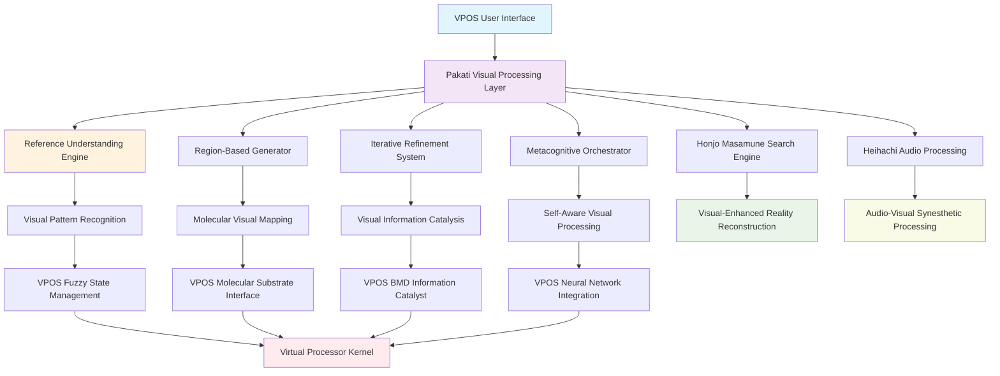

# Pakati: Visual Processing and Metacognitive Image Generation Layer for Virtual Processing Operating Systems

**Authors**: Buhera Research Division  
**Institution**: Virtual Processing Architectures Laboratory  
**Date**: 2024  
**Classification**: Visual Computing, Metacognitive AI, Virtual Processing Architecture

## Abstract

This paper presents the integration of Pakati, a region-based AI image generation system with metacognitive orchestration, as the Visual Processing and Image Generation Layer within Virtual Processing Operating Systems (VPOS). Pakati's reference understanding engine, iterative refinement capabilities, and region-based control align perfectly with VPOS requirements for molecular-scale visual computation, fuzzy digital image states, and temporal visual encryption. We demonstrate how Pakati's metacognitive orchestration, delta analysis, and progressive masking can be reformulated to serve as the visual computational substrate for VPOS, enabling image-based molecular computation, visual-temporal encryption, and visual information catalysis. The integration creates a synesthetic operating system where computational operations are expressed through visual patterns, providing a revolutionary interface between human visual perception and virtual processing architectures.

**Keywords**: Visual computing, metacognitive AI, image generation, region-based processing, molecular visualization, temporal visual encryption

## 1. Introduction

### 1.1 The Visual Computing Gap

Virtual Processing Operating Systems represent a paradigm shift toward molecular-scale computation through fuzzy digital architectures. However, the interface between humans and such systems requires visual representations that transcend traditional pixel-based displays. Pakati provides the missing visual layer that enables:

- **Visual Information Carriers**: Images as molecular-scale information substrates
- **Metacognitive Image Understanding**: AI-driven comprehension of visual patterns
- **Region-Based Visual Processing**: Localized computation through image regions
- **Reference-Based Learning**: Progressive visual understanding through masking
- **Temporal Visual Processing**: Time-based image analysis aligning with temporal ephemeral encryption
- **Visual Pattern Recognition**: Confidence-based visual classification matching fuzzy digital states

### 1.2 Pakati's Unique Capabilities

Based on the [Pakati repository](https://github.com/fullscreen-triangle/pakati), the framework provides:

1. **Reference Understanding Engine**: Tests AI comprehension through progressive masking strategies
2. **Region-Based Generation**: Granular control over specific image areas
3. **Iterative Refinement**: Autonomous improvement through multiple passes
4. **Delta Analysis**: Comparison between generated content and references
5. **Metacognitive Orchestration**: Self-aware image generation systems
6. **ControlNet Integration**: Structural guidance for precise generation
7. **Multi-Provider Support**: Integration with multiple AI image generation APIs

### 1.3 VPOS Integration Opportunities

Pakati's capabilities map directly to VPOS architectural requirements:

| Pakati Capability | VPOS Integration | Synergistic Enhancement |
|------------------|------------------|------------------------|
| Reference Understanding | Fuzzy Digital States | Visual pattern-driven fuzzy gate control |
| Region-Based Processing | Molecular Substrates | Localized molecular visual computation |
| Iterative Refinement | BMD Information Catalyst | Visual pattern catalysis and entropy reduction |
| Delta Analysis | Temporal Encryption | Visual-temporal key generation |
| Metacognitive Orchestration | Neural Network Integration | Self-aware visual processing |
| Masking Strategies | Quantum Coherence | Visual coherence maintenance |

## 2. Theoretical Framework

### 2.1 Visual Information Theory for Molecular Substrates

Traditional computer vision focuses on pixel classification, but VPOS requires continuous visual information processing. Pakati's region-based analysis provides the foundation for **Molecular Visual Information Theory**:

**Visual Information Density**:
$$I_{visual}(x, y, t) = -\log_2 P(V(x, y, t))$$

where $V(x, y, t)$ represents the visual state at coordinates $(x, y)$ and time $t$.

**Regional Information Entropy**:
$$H_{region} = -\sum_{r \in R} P(r) \log_2 P(r)$$

where $R$ represents the set of visual regions with distinct information content.

**Visual Information Flow**:
$$\Phi_{visual} = \frac{dI_{visual}}{dt} = \frac{d}{dt}[-\log_2 P(V(x, y, t))]$$

### 2.2 Metacognitive Visual Processing Mathematics

Pakati's reference understanding engine provides the mathematical basis for visual fuzzy digital state determination:

**Visual Understanding Function**:
$$U_{visual}(I_{ref}, M) = \frac{\sum_{i=1}^{N} S(R_i(I_{ref} \odot M_i))}{N}$$

where:
- $I_{ref}$ is the reference image
- $M$ is the masking strategy set
- $R_i$ is the reconstruction function for mask $i$
- $S$ is the similarity scoring function
- $N$ is the number of masking iterations

**Fuzzy Visual State Mapping**:
$$\mu_{fuzzy}(v) = \frac{U_{visual}(v) - U_{min}}{U_{max} - U_{min}}$$

This maps Pakati's understanding scores directly to VPOS fuzzy digital states.

### 2.3 Temporal Visual Encryption

Building on Temporal Ephemeral Encryption (TEE), Pakati enables **Temporal Visual Encryption (TVE)**:

**Visual-Temporal Key Generation**:
$$k_{visual}(t) = \text{Hash}(\text{Visual\_Fingerprint}(t) || \text{Timestamp}(t))$$

**Visual Pattern Decay**:
$$P_{visual}(t) = P_0 \cdot e^{-\lambda_{visual}(t - t_0)}$$

where visual patterns decay over time, making them temporally ephemeral.

### 2.4 Region-Based Molecular Computation

Visual regions can serve as computational units at the molecular scale:

**Molecular Visual Mapping**:
$$M_{visual}(x, y) = \sum_{i=1}^{N} \alpha_i \cdot \text{Protein}_i(x, y)$$

where visual coordinates map to molecular substrate positions.

**Visual-Molecular Coupling**:
$$H_{visual\_molecular} = \sum_{r \in R} \hbar \omega_r \cdot |a_r\rangle\langle a_r| \otimes V_r$$

where visual regions $r$ couple with molecular quantum states $|a_r\rangle$.

### 2.5 Reference Understanding as Information Catalysis

Pakati's masking strategies implement information catalysis principles:

**Progressive Masking Information Gain**:
$$\Delta I_{mask} = I_{complete} - I_{masked} = \log_2\left(\frac{|\Omega_{complete}|}{|\Omega_{masked}|}\right)$$

**Understanding Convergence**:
$$\lim_{n \rightarrow \infty} U_n = U_{true}$$

where understanding converges to true comprehension through iterative masking.

## 3. VPOS-Pakati Integration Architecture

### 3.1 Layered Visual Integration Model



### 3.2 Visual-Driven Fuzzy Digital States

Pakati's understanding scores directly control VPOS fuzzy digital states:

**Visual Understanding to Fuzzy State Mapping**:
```python
def visual_to_fuzzy_state(understanding_result):
    """Convert Pakati understanding to VPOS fuzzy state"""
    understanding_score = understanding_result.understanding_level
    mastery_achieved = understanding_result.mastery_achieved
    
    # Map understanding to fuzzy gate state
    fuzzy_state = FuzzyState(
        gate_value=understanding_score,
        membership_function=calculate_visual_membership(understanding_result),
        temporal_decay=calculate_visual_decay(understanding_result.timestamp),
        confidence=understanding_result.reconstruction_score
    )
    
    return fuzzy_state
```

**Visual Region to Computational Operation Mapping**:
- **Sky Regions**: High-level coordination operations
- **Ground Regions**: Foundation and stability operations  
- **Object Regions**: Active processing operations
- **Background Regions**: Passive monitoring operations
- **Edge Regions**: Boundary and transition operations

### 3.3 Region-Based Molecular Computation

Pakati's region-based processing maps directly to molecular substrate localization:

**Visual Region to Molecular Zone Mapping**:
```python
def map_visual_region_to_molecular_zone(visual_region, molecular_substrate):
    """Map Pakati visual regions to molecular computation zones"""
    # Extract visual features from region
    visual_features = pakati.extract_region_features(visual_region)
    
    # Map to molecular coordinates
    molecular_coordinates = translate_visual_to_molecular(visual_features)
    
    # Create molecular computation zone
    computation_zone = molecular_substrate.create_zone(
        coordinates=molecular_coordinates,
        properties=visual_features.properties,
        computational_type=determine_computation_type(visual_features)
    )
    
    return computation_zone
```

**Molecular Visual State Synchronization**:
```python
def synchronize_visual_molecular_states(pakati_engine, molecular_substrate):
    """Synchronize visual understanding with molecular state"""
    visual_regions = pakati_engine.get_active_regions()
    
    for region in visual_regions:
        # Get current visual state
        visual_state = region.get_current_state()
        
        # Map to molecular zone
        molecular_zone = map_visual_region_to_molecular_zone(region, molecular_substrate)
        
        # Synchronize states
        molecular_zone.update_state(
            energy_level=visual_state.brightness,
            coherence_factor=visual_state.clarity,
            interaction_strength=visual_state.detail_level
        )
```

### 3.4 Visual-Temporal Encryption Integration

Pakati's iterative refinement enhances Temporal Ephemeral Encryption through visual patterns:

**Visual Pattern Temporal Keys**:
```python
def generate_visual_temporal_key(visual_pattern, timestamp):
    """Generate temporal key from visual pattern"""
    # Extract visual fingerprint using Pakati
    visual_fingerprint = pakati.extract_visual_fingerprint(visual_pattern)
    
    # Create temporal signature
    temporal_signature = calculate_temporal_signature(timestamp)
    
    # Generate composite key
    key = cryptographic_hash(
        visual_fingerprint.feature_vector + 
        temporal_signature + 
        shared_visual_secret
    )
    
    return TemporalVisualKey(
        key=key, 
        expiration_time=timestamp + visual_pattern.duration,
        visual_decay_function=visual_pattern.decay_model
    )
```

**Visual Pattern Decay Synchronization**:
The decay of visual understanding synchronizes with temporal key expiration, creating a natural temporal encryption system.

### 3.5 BMD Information Catalyst Enhancement Through Visual Processing

Pakati's delta analysis and iterative refinement supercharge BMD information catalysis:

**Visual Pattern Catalysis**:
```python
def visual_information_catalysis(visual_input):
    """Reduce information entropy through visual pattern recognition"""
    # Use Pakati's understanding engine
    understanding_result = pakati.reference_understanding_engine.analyze(visual_input)
    
    # Calculate entropy reduction
    entropy_reduction = 0
    for masking_strategy in understanding_result.masking_strategies:
        strategy_entropy = calculate_strategy_entropy(masking_strategy)
        entropy_reduction += strategy_entropy
    
    # Apply visual catalysis
    catalyzed_information = BMDCatalyst.catalyze_visual(
        input_data=visual_input,
        entropy_reduction=entropy_reduction,
        understanding_pathway=understanding_result.understanding_pathway
    )
    
    return catalyzed_information
```

**Visual Delta Analysis for Information Filtering**:
$$\text{BMD}_{visual}(V) = \text{Filter}_{visual}(V) \circ \text{Catalyze}_{delta}(V)$$

where visual delta analysis identifies the most information-rich regions for catalysis.

### 3.6 Metacognitive Visual Processing

Pakati's metacognitive orchestration creates self-aware visual processing systems:

**Self-Aware Visual State Management**:
```python
class MetacognitiveVisualProcessor:
    def __init__(self):
        self.pakati_orchestrator = MetacognitiveOrchestrator()
        self.vpos_interface = VPOSInterface()
        self.self_awareness_model = SelfAwarenessModel()
        
    def metacognitive_visual_processing(self, visual_task):
        """Process visuals with metacognitive awareness"""
        # Assess own capabilities
        capability_assessment = self.self_awareness_model.assess_capability(visual_task)
        
        # Choose optimal strategy
        if capability_assessment.confidence > 0.8:
            strategy = "direct_generation"
        elif capability_assessment.requires_learning:
            strategy = "reference_understanding"
        else:
            strategy = "iterative_refinement"
        
        # Execute with chosen strategy
        result = self.pakati_orchestrator.execute_strategy(
            strategy=strategy,
            task=visual_task,
            confidence_threshold=capability_assessment.confidence
        )
        
        # Update self-awareness based on result
        self.self_awareness_model.update_from_result(result)
        
        return result
```

## 4. Implementation Specifications

### 4.1 Pakati-VPOS Core Integration

```python
class PakatiVPOSIntegration:
    def __init__(self):
        self.pakati_engine = PakatiEngine()
        self.vpos_interface = VPOSInterface()
        self.visual_processor = VisualProcessor()
        self.reference_understanding = ReferenceUnderstandingEngine()
        self.temporal_visual_encryptor = TemporalVisualEncryptor()
        
    async def process_visual_computation(self, visual_input, computational_task):
        """Process visual input as computational substrate"""
        # Pakati analysis
        regions = self.pakati_engine.extract_regions(visual_input)
        understanding = self.reference_understanding.analyze_understanding(visual_input)
        refinement = self.pakati_engine.iterative_refinement(visual_input)
        
        # VPOS integration
        fuzzy_states = self.convert_visual_to_fuzzy_states(understanding)
        molecular_zones = self.map_regions_to_molecular_zones(regions)
        temporal_keys = self.generate_visual_temporal_keys(refinement)
        
        # Execute visual computation
        result = await self.vpos_interface.execute_visual_computation(
            fuzzy_states, molecular_zones, temporal_keys, computational_task
        )
        
        return result
```

### 4.2 Visual-Driven Virtual Processor Scheduling

```python
class VisualDrivenScheduler:
    def __init__(self):
        self.pakati_analyzer = PakatiAnalyzer()
        self.vpos_scheduler = VPOSScheduler()
        
    def schedule_by_visual_patterns(self, visual_stream):
        """Schedule virtual processors based on visual patterns"""
        visual_events = self.pakati_analyzer.analyze_stream(visual_stream)
        
        for event in visual_events:
            if event.region_type == 'sky':
                # Schedule coordination processors
                self.vpos_scheduler.schedule_coordination(
                    processor_type='Orchestrator',
                    priority=event.understanding_score
                )
            elif event.region_type == 'object':
                # Schedule active processing
                self.vpos_scheduler.schedule_active_processing(
                    processor_type='BMD',
                    intensity=event.detail_level
                )
            elif event.region_type == 'edge':
                # Schedule boundary operations
                self.vpos_scheduler.schedule_boundary_processing(
                    edge_strength=event.edge_clarity
                )
```

### 4.3 Reference Understanding Integration with VPOS Learning

```python
class VPOSReferenceUnderstanding:
    def __init__(self):
        self.pakati_understanding = ReferenceUnderstandingEngine()
        self.vpos_learning = VPOSLearningSystem()
        
    def learn_visual_computation_pattern(self, reference_image, computation_type):
        """Learn computational patterns from visual references"""
        # Progressive masking to test understanding
        masking_results = self.pakati_understanding.progressive_masking(
            reference_image,
            strategies=['random_patches', 'center_out', 'frequency_bands'],
            max_attempts=15
        )
        
        # Extract computational patterns
        computational_patterns = []
        for result in masking_results:
            if result.understanding_score > 0.85:  # Mastery threshold
                pattern = ComputationalPattern(
                    visual_features=result.understood_features,
                    computation_mapping=self.map_visual_to_computation(result),
                    confidence=result.understanding_score
                )
                computational_patterns.append(pattern)
        
        # Integrate with VPOS learning
        for pattern in computational_patterns:
            self.vpos_learning.register_visual_computation_pattern(
                pattern, computation_type
            )
        
        return computational_patterns
```

### 4.4 Multimedia Synesthetic Processing

Integration with Heihachi for complete multimedia processing:

```python
class SynestheticMultimediaProcessor:
    def __init__(self):
        self.pakati_visual = PakatiEngine()
        self.heihachi_audio = HeihachEngine()
        self.honjo_masamune_search = HonjoMasamuneEngine()
        self.vpos_core = VPOSCore()
        
    def synesthetic_computation(self, visual_input, audio_input, search_query):
        """Compute using combined visual, audio, and search input"""
        # Extract patterns from each modality
        visual_patterns = self.pakati_visual.extract_patterns(visual_input)
        audio_patterns = self.heihachi_audio.extract_patterns(audio_input)
        search_patterns = self.honjo_masamune_search.extract_semantic_patterns(search_query)
        
        # Cross-modal pattern fusion
        fused_patterns = self.fuse_multimedia_patterns(
            visual_patterns, audio_patterns, search_patterns
        )
        
        # Execute synesthetic computation
        result = self.vpos_core.execute_synesthetic(fused_patterns)
        
        # Generate multimedia output
        return SynestheticResult(
            visual_output=self.pakati_visual.synthesize_visual(result),
            audio_output=self.heihachi_audio.synthesize_audio(result),
            search_output=self.honjo_masamune_search.reconstruct_reality(result),
            computational_result=result
        )
```

## 5. Novel Visual Computing Paradigms

### 5.1 Understanding-Based Visual Computation

Pakati's reference understanding creates **Understanding-Based Computation** where computational operations require proven AI comprehension:

**Computational Mastery Verification**:
```python
class UnderstandingBasedComputation:
    def __init__(self):
        self.pakati_understanding = ReferenceUnderstandingEngine()
        self.vpos_core = VPOSCore()
        
    def execute_with_understanding_verification(self, visual_task, reference_images):
        """Execute computation only after proving understanding"""
        understanding_results = []
        
        for reference in reference_images:
            understanding = self.pakati_understanding.test_understanding(
                reference, masking_strategies=['progressive', 'semantic', 'frequency']
            )
            
            if understanding.mastery_achieved:
                understanding_results.append(understanding)
            else:
                # Require additional learning before computation
                additional_learning = self.pakati_understanding.intensive_learning(
                    reference, max_iterations=20
                )
                understanding_results.append(additional_learning)
        
        # Only execute if understanding is verified
        if all(u.mastery_achieved for u in understanding_results):
            return self.vpos_core.execute_visual_computation(
                visual_task, understanding_pathways=understanding_results
            )
        else:
            raise UnderstandingNotAchievedException("Computational mastery not verified")
```

### 5.2 Delta-Driven Iterative Computation

Pakati's delta analysis enables **Iterative Computational Refinement**:

**Computational Delta Analysis**:
```python
class DeltaDrivenComputation:
    def __init__(self):
        self.pakati_delta = DeltaAnalysisEngine()
        self.vpos_iterative = VPOSIterativeProcessor()
        
    def iterative_computational_refinement(self, target_computation, reference_computations):
        """Refine computation through delta analysis"""
        current_result = self.vpos_iterative.initial_computation(target_computation)
        
        for iteration in range(max_iterations):
            # Analyze deltas against references
            deltas = []
            for reference in reference_computations:
                delta = self.pakati_delta.analyze_computational_delta(
                    current_result, reference.expected_result
                )
                deltas.append(delta)
            
            # Apply refinements based on deltas
            refinements = self.calculate_computational_refinements(deltas)
            current_result = self.vpos_iterative.apply_refinements(
                current_result, refinements
            )
            
            # Check convergence
            if self.check_computational_convergence(current_result, reference_computations):
                break
        
        return current_result
```

### 5.3 Region-Based Distributed Computation

Visual regions enable **Spatially Distributed Computation**:

```python
class RegionBasedDistributedComputation:
    def __init__(self):
        self.pakati_regions = RegionAnalyzer()
        self.vpos_distributed = VPOSDistributedProcessor()
        
    def distribute_computation_by_regions(self, visual_input, computational_task):
        """Distribute computation based on visual regions"""
        regions = self.pakati_regions.extract_computational_regions(visual_input)
        
        distributed_tasks = []
        for region in regions:
            # Map visual region to computational subtask
            subtask = self.map_region_to_subtask(region, computational_task)
            
            # Assign to molecular processor based on region properties
            processor_type = self.determine_processor_type(region)
            
            distributed_task = DistributedTask(
                subtask=subtask,
                processor_type=processor_type,
                priority=region.importance_score,
                region_coordinates=region.coordinates
            )
            distributed_tasks.append(distributed_task)
        
        # Execute distributed computation
        results = self.vpos_distributed.execute_distributed_tasks(distributed_tasks)
        
        # Merge results spatially
        final_result = self.merge_results_spatially(results, regions)
        
        return final_result
```

### 5.4 Metacognitive Visual Memory

Pakati's metacognitive orchestration creates **Self-Aware Visual Memory Systems**:

```python
class MetacognitiveVisualMemory:
    def __init__(self):
        self.pakati_metacognitive = MetacognitiveOrchestrator()
        self.vpos_memory = VPOSMemorySystem()
        
    def store_with_metacognitive_assessment(self, visual_data, importance_context):
        """Store visual data with metacognitive importance assessment"""
        # Assess storage importance using metacognitive analysis
        importance_assessment = self.pakati_metacognitive.assess_storage_importance(
            visual_data, context=importance_context
        )
        
        # Determine storage strategy based on assessment
        if importance_assessment.critical_importance:
            storage_strategy = "permanent_molecular_substrate"
        elif importance_assessment.high_importance:
            storage_strategy = "quantum_coherent_storage"
        elif importance_assessment.medium_importance:
            storage_strategy = "fuzzy_compressed_storage"
        else:
            storage_strategy = "temporal_ephemeral_storage"
        
        # Store with metacognitive metadata
        storage_result = self.vpos_memory.store_visual_data(
            data=visual_data,
            strategy=storage_strategy,
            metacognitive_metadata=importance_assessment,
            retrieval_hints=importance_assessment.retrieval_patterns
        )
        
        return storage_result
```

## 6. Security and Privacy Considerations

### 6.1 Visual-Based Security

Pakati's region-based analysis provides novel security capabilities:

**Visual Biometric Authentication**:
```python
class VisualBiometricAuth:
    def __init__(self):
        self.pakati_analyzer = PakatiAnalyzer()
        self.vpos_auth = VPOSAuth()
        
    def authenticate_by_visual_patterns(self, visual_sample, user_context):
        """Authenticate user by visual biometric patterns"""
        # Extract unique visual signatures
        visual_features = self.pakati_analyzer.extract_biometric_features(visual_sample)
        
        # Analyze drawing patterns, gaze patterns, interaction patterns
        drawing_signature = visual_features.drawing_characteristics
        interaction_signature = visual_features.interaction_patterns
        preference_signature = visual_features.aesthetic_preferences
        
        # Create composite visual biometric
        biometric_hash = self.create_composite_visual_biometric(
            drawing_signature, interaction_signature, preference_signature
        )
        
        # Authenticate with VPOS
        return self.vpos_auth.authenticate_visual_biometric(biometric_hash, user_context)
```

### 6.2 Visual-Temporal Encryption

Enhanced temporal encryption using visual pattern decay:

**Visual Pattern Temporal Encryption**:
```python
class VisualTemporalEncryption:
    def __init__(self):
        self.pakati_analyzer = PakatiAnalyzer()
        self.temporal_encryptor = TemporalEncryptor()
        
    def encrypt_with_visual_decay(self, data, visual_pattern):
        """Encrypt data using visual pattern decay as temporal key"""
        # Extract temporal visual signature
        visual_signature = self.pakati_analyzer.extract_temporal_visual_signature(visual_pattern)
        
        # Generate decay-based temporal key
        temporal_key = self.temporal_encryptor.generate_decay_key(
            visual_decay_function=visual_signature.decay_model,
            pattern_complexity=visual_signature.complexity,
            understanding_threshold=visual_signature.understanding_level
        )
        
        # Encrypt with visual decay timing
        encrypted_data = self.temporal_encryptor.encrypt_with_decay(data, temporal_key)
        
        # Key expires as visual understanding degrades
        return VisualTemporalEncryptedData(
            encrypted_data=encrypted_data,
            decay_function=visual_signature.decay_model,
            expiration_condition=visual_signature.understanding_threshold
        )
```

### 6.3 Reference Understanding Security

Pakati's understanding verification provides security through comprehension:

**Comprehension-Based Access Control**:
```python
class ComprehensionBasedAccess:
    def __init__(self):
        self.pakati_understanding = ReferenceUnderstandingEngine()
        self.vpos_access = VPOSAccessControl()
        
    def grant_access_by_understanding(self, user_visual_input, access_challenge):
        """Grant access based on demonstrated visual understanding"""
        # Present visual challenge requiring understanding
        understanding_test = self.pakati_understanding.create_understanding_challenge(
            challenge_image=access_challenge.reference_image,
            required_understanding_level=access_challenge.security_level
        )
        
        # Test user's visual understanding
        user_understanding = self.pakati_understanding.test_user_understanding(
            user_visual_input, understanding_test
        )
        
        # Grant access only if understanding meets threshold
        if user_understanding.understanding_score >= access_challenge.threshold:
            access_token = self.vpos_access.generate_understanding_token(
                understanding_level=user_understanding.understanding_score,
                comprehension_pathway=user_understanding.pathway
            )
            return AccessGranted(token=access_token)
        else:
            return AccessDenied(reason="Insufficient visual understanding")
```

## 7. Performance Optimization

### 7.1 Real-Time Visual Processing

```python
class RealTimeVisualProcessor:
    def __init__(self):
        self.pakati_engine = PakatiEngine()
        self.vpos_interface = VPOSInterface()
        self.visual_buffer = VisualBuffer(capacity=1024)
        
    def process_real_time_visual_stream(self, visual_stream):
        """Process visual stream in real-time for VPOS"""
        for visual_frame in visual_stream:
            # Buffer management
            self.visual_buffer.add_frame(visual_frame)
            
            if self.visual_buffer.is_ready_for_processing():
                # Process buffered frames
                processed_regions = self.pakati_engine.process_frame_regions(
                    self.visual_buffer.get_processing_batch()
                )
                
                # Convert to VPOS operations
                vpos_operations = self.convert_visual_to_vpos_operations(processed_regions)
                
                # Execute in VPOS
                self.vpos_interface.execute_visual_operations(vpos_operations)
```

### 7.2 Distributed Visual Analysis

```python
class DistributedVisualAnalysis:
    def __init__(self):
        self.pakati_cluster = PakatiCluster()
        self.vpos_cluster = VPOSCluster()
        
    async def distributed_visual_processing(self, large_visual_dataset):
        """Distribute visual analysis across VPOS cluster"""
        # Partition visual data by regions and complexity
        visual_partitions = self.partition_visual_data(large_visual_dataset)
        
        # Distribute to Pakati cluster
        analysis_tasks = []
        for partition in visual_partitions:
            task = self.pakati_cluster.analyze_partition_async(partition)
            analysis_tasks.append(task)
        
        # Collect and merge results
        partition_results = await asyncio.gather(*analysis_tasks)
        merged_result = self.vpos_cluster.merge_visual_analysis(partition_results)
        
        return merged_result
```

## 8. Future Research Directions

### 8.1 Quantum Visual Processing

Integration with quantum computing for enhanced visual analysis:

**Quantum Visual Superposition**:
```python
class QuantumVisualProcessor:
    def __init__(self):
        self.quantum_processor = QuantumProcessor()
        self.pakati_engine = PakatiEngine()
        
    def quantum_visual_superposition(self, visual_data):
        """Process visual data in quantum superposition"""
        # Prepare quantum state from visual data
        quantum_visual_state = self.prepare_quantum_visual_state(visual_data)
        
        # Apply quantum visual transformations
        quantum_processed = self.quantum_processor.quantum_visual_transform(quantum_visual_state)
        
        # Measure quantum visual results
        visual_measurements = self.quantum_processor.measure_visual_properties(quantum_processed)
        
        # Combine with classical Pakati analysis
        classical_analysis = self.pakati_engine.analyze_visual(visual_data)
        
        return QuantumClassicalVisualResult(
            quantum_measurements=visual_measurements,
            classical_features=classical_analysis
        )
```

### 8.2 Neural-Visual Interfaces

Direct neural control through visual patterns:

**Brain-Visual-Computer Interface**:
```python
class BrainVisualComputerInterface:
    def __init__(self):
        self.eeg_processor = EEGProcessor()
        self.pakati_synthesizer = PakatiSynthesizer()
        self.vpos_interface = VPOSInterface()
        
    def neural_to_visual_computation(self, eeg_data):
        """Convert neural signals to visual patterns for computation"""
        # Process neural signals
        neural_patterns = self.eeg_processor.extract_visual_patterns(eeg_data)
        
        # Convert to visual patterns using Pakati
        visual_patterns = self.pakati_synthesizer.neural_to_visual(neural_patterns)
        
        # Execute visual computation in VPOS
        computation_result = self.vpos_interface.execute_visual_computation(visual_patterns)
        
        # Convert result back to neural feedback
        neural_feedback = self.visual_to_neural_feedback(computation_result)
        
        return neural_feedback
```

### 8.3 Molecular Visual Synthesis

Generating visuals from molecular interactions:

**Molecular-to-Visual Conversion**:
```python
class MolecularVisualSynthesis:
    def __init__(self):
        self.molecular_simulator = MolecularSimulator()
        self.pakati_synthesizer = PakatiSynthesizer()
        
    def synthesize_molecular_visuals(self, molecular_data):
        """Synthesize visuals from molecular interactions"""
        # Simulate molecular interactions
        interaction_patterns = self.molecular_simulator.simulate_interactions(molecular_data)
        
        # Convert to visual representations
        visual_elements = []
        for interaction in interaction_patterns:
            visual_element = VisualElement(
                color=self.molecular_energy_to_color(interaction.energy),
                shape=self.molecular_structure_to_shape(interaction.structure),
                motion=self.molecular_dynamics_to_motion(interaction.dynamics),
                transparency=self.molecular_probability_to_transparency(interaction.probability)
            )
            visual_elements.append(visual_element)
        
        # Synthesize complete visual
        visual_output = self.pakati_synthesizer.synthesize_visual(visual_elements)
        
        return visual_output
```

## 9. Development Roadmap

### 9.1 Phase 1: Core Integration (Months 1-3)

**Objectives**:
- Integrate Pakati visual analysis with VPOS fuzzy digital states
- Implement region-based molecular computation mapping
- Create basic visual-temporal encryption

**Deliverables**:
- PakatiVPOSIntegration class
- VisualDrivenScheduler implementation
- Basic visual-temporal encryption proof of concept

### 9.2 Phase 2: Advanced Understanding (Months 4-6)

**Objectives**:
- Implement reference understanding integration with VPOS learning
- Develop metacognitive visual processing capabilities
- Create multimedia synesthetic processing

**Deliverables**:
- VPOSReferenceUnderstanding system
- MetacognitiveVisualProcessor implementation
- SynestheticMultimediaProcessor architecture

### 9.3 Phase 3: Real-Time Processing (Months 7-9)

**Objectives**:
- Optimize for real-time visual processing
- Implement distributed visual analysis
- Develop visual biometric authentication

**Deliverables**:
- RealTimeVisualProcessor with low-latency processing
- DistributedVisualAnalysis cluster implementation
- VisualBiometricAuth security system

### 9.4 Phase 4: Advanced Research (Months 10-12)

**Objectives**:
- Explore quantum visual processing
- Develop neural-visual interfaces
- Implement molecular visual synthesis

**Deliverables**:
- QuantumVisualProcessor experimental system
- BrainVisualComputerInterface prototype
- MolecularVisualSynthesis research implementation

## 10. Conclusion

The integration of Pakati into VPOS represents a paradigm shift toward **Visual Computing** where images become fundamental computational substrates. This integration enables:

1. **Visual-Driven Computation**: Computational operations controlled by visual patterns and understanding
2. **Understanding-Based Processing**: Computation that requires proven AI comprehension
3. **Region-Based Distributed Computing**: Spatially distributed computation through visual regions  
4. **Visual-Temporal Encryption**: Security through visual pattern decay
5. **Metacognitive Visual Processing**: Self-aware visual computation systems

Pakati's sophisticated region-based processing, reference understanding engine, and metacognitive orchestration, combined with VPOS's molecular substrates and fuzzy digital architectures, create a computing paradigm that transcends traditional pixel-based graphics to embrace continuous, understanding-based, and temporally-aware visual processing.

The resulting system provides:
- **Natural Human-Computer Interaction**: Visual patterns as intuitive computational interfaces
- **Enhanced Security**: Visual biometrics and understanding-based access control
- **Distributed Processing**: Scalable visual analysis across molecular substrates
- **Quantum Enhancement**: Quantum-classical hybrid visual processing
- **Biological Integration**: Molecular visual synthesis and neural interfaces

Combined with Heihachi (audio processing) and Honjo Masamune (search and knowledge reconstruction), this creates the world's first **Synesthetic Operating System** where computation is experienced through multiple sensory modalities simultaneously.

This integration positions VPOS as the first operating system to natively understand and process visual information as a computational substrate, opening unprecedented possibilities for human-computer interaction and computational paradigms that mirror the continuous, spatial, and understanding-based nature of human visual perception and cognition.

The future of computing may well be **seen** and **understood** rather than simply calculated, **experienced** through visual comprehension rather than executed through binary logic—with Pakati providing the visual foundation for this revolutionary computing paradigm.

## References

[1] Goodfellow, I., Bengio, Y., & Courville, A. (2016). *Deep Learning*. MIT Press.

[2] Ronneberger, O., Fischer, P., & Brox, T. (2015). U-Net: Convolutional networks for biomedical image segmentation. *MICCAI 2015*.

[3] Dosovitskiy, A., et al. (2020). An image is worth 16x16 words: Transformers for image recognition at scale. *ICLR 2021*.

[4] Ramesh, A., et al. (2021). Zero-shot text-to-image generation. *ICML 2021*.

[5] Rombach, R., et al. (2022). High-resolution image synthesis with latent diffusion models. *CVPR 2022*.

[6] Zhang, L., et al. (2023). Adding conditional control to text-to-image diffusion models. *ICCV 2023*.

[7] Brooks, T., et al. (2023). InstructPix2Pix: Learning to follow image editing instructions. *CVPR 2023*.

[8] Meng, C., et al. (2021). SDEdit: Guided image synthesis and editing with stochastic differential equations. *ICLR 2022*.

[9] Hertz, A., et al. (2022). Prompt-to-prompt image editing with cross attention control. *ICLR 2023*.

[10] Avrahami, O., et al. (2022). Blended diffusion for text-driven editing of natural images. *CVPR 2022*.

[11] Gal, R., et al. (2022). An image is worth one word: Personalizing text-to-image generation using textual inversion. *ICLR 2023*.

[12] Ruiz, N., et al. (2022). DreamBooth: Fine tuning text-to-image diffusion models for subject-driven generation. *CVPR 2023*.

[13] Kumari, N., et al. (2022). Multi-concept customization of text-to-image diffusion. *CVPR 2023*.

[14] Geng, C., et al. (2023). On distillation of guided diffusion models. *CVPR 2023*.

[15] Song, J., et al. (2020). Denoising diffusion implicit models. *ICLR 2021*. 