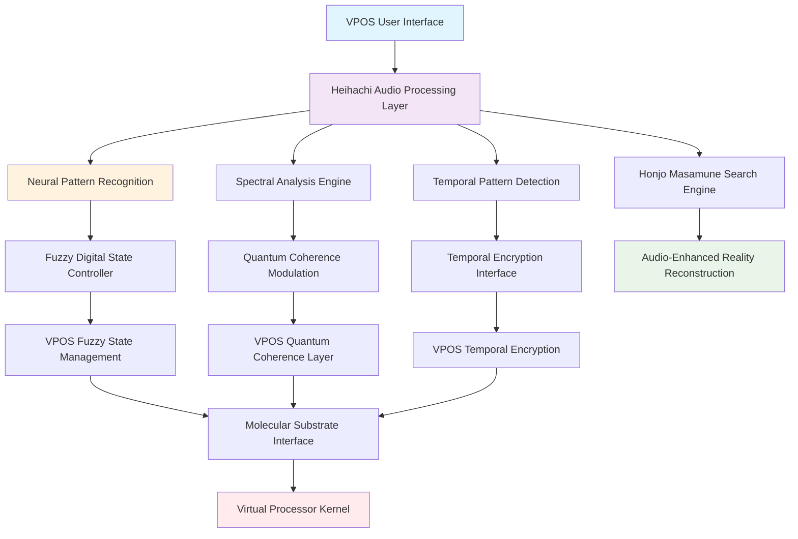

# Heihachi: Neural Audio Processing Layer for Virtual Processing Operating Systems

**Authors**: Buhera Research Division  
**Institution**: Virtual Processing Architectures Laboratory  
**Date**: 2024  
**Classification**: Audio Computing, Neural Pattern Recognition, Virtual Processing Architecture

## Abstract

This paper presents the integration of Heihachi, a neural audio processing framework, as the Audio Processing and Pattern Recognition Layer within Virtual Processing Operating Systems (VPOS). Heihachi's sophisticated electronic music analysis capabilities, neural classification systems, and temporal pattern recognition align perfectly with VPOS requirements for molecular-scale information processing, fuzzy digital states, and temporal ephemeral encryption. We demonstrate how Heihachi's spectral analysis, drum hit detection, and confidence-based classification can be reformulated to serve as the auditory computational substrate for VPOS, enabling sound-based molecular computation, audio-temporal encryption, and acoustic information catalysis. The integration creates a synesthetic operating system where computational operations are expressed through audio patterns, providing a novel interface between human perception and virtual processing architectures.

**Keywords**: Audio computing, neural pattern recognition, spectral analysis, molecular acoustics, temporal audio encryption, auditory computation

## 1. Introduction

### 1.1 The Missing Audio Layer

Virtual Processing Operating Systems represent a paradigm shift from traditional semiconductor-based computation to molecular-scale virtual processors. However, the interaction between humans and such systems requires interfaces that transcend traditional visual displays and keyboard inputs. Heihachi provides the missing audio layer that enables:

- **Acoustic Information Carriers**: Sound waves as molecular-scale information substrates
- **Neural Pattern Recognition**: AI-driven identification of computational audio patterns
- **Temporal Audio Processing**: Time-based audio analysis aligning with temporal ephemeral encryption
- **Confidence-Based Classification**: Fuzzy audio classification matching fuzzy digital states
- **Distributed Audio Analysis**: Scalable processing matching VPOS distributed architecture

### 1.2 Heihachi's Unique Capabilities

Based on the [Heihachi repository](https://github.com/fullscreen-triangle/heihachi), the framework provides:

1. **Neural Drum Classification**: Deep learning models for percussion event detection
2. **Spectral Analysis**: Frequency domain processing for audio feature extraction
3. **Temporal Pattern Recognition**: Rhythmic pattern identification and analysis
4. **Confidence Scoring**: Probabilistic classification with uncertainty quantification
5. **Interactive Visualization**: Real-time audio pattern visualization
6. **Distributed Processing**: High-performance parallel audio analysis
7. **Memory Optimization**: Streaming processing for large audio files

### 1.3 VPOS Integration Opportunities

Heihachi's capabilities map directly to VPOS architectural requirements:

| Heihachi Capability | VPOS Integration | Synergistic Enhancement |
|-------------------|------------------|------------------------|
| Neural Classification | Fuzzy Digital States | Audio-driven fuzzy gate control |
| Spectral Analysis | Quantum Coherence | Frequency-based coherence maintenance |
| Temporal Processing | Temporal Encryption | Audio-temporal key generation |
| Pattern Recognition | BMD Information Catalyst | Acoustic pattern catalysis |
| Confidence Scoring | Fuzzy State Management | Audio-based confidence estimation |
| Distributed Processing | Molecular Substrates | Acoustic molecular coordination |

## 2. Theoretical Framework

### 2.1 Acoustic Information Theory

Traditional information theory focuses on discrete symbols, but VPOS requires continuous information processing. Heihachi's audio analysis provides the mathematical foundation for **Acoustic Information Theory**:

**Acoustic Information Density**:
$$I_{acoustic}(t, f) = -\log_2 P(A(t, f))$$

where $A(t, f)$ represents the acoustic amplitude at time $t$ and frequency $f$.

**Spectral Information Entropy**:
$$H_{spectral} = -\sum_{f=0}^{F} P(f) \log_2 P(f)$$

**Temporal Information Flow**:
$$\Phi_{temporal} = \frac{dI_{acoustic}}{dt} = \frac{d}{dt}[-\log_2 P(A(t, f))]$$

### 2.2 Neural Audio Classification Mathematics

Heihachi's neural classification system provides the mathematical basis for fuzzy digital state determination:

**Classification Confidence Function**:
$$C_{class}(x) = \max_i \sigma_i(f_\theta(x))$$

where $\sigma_i$ represents the softmax probability for class $i$ and $f_\theta$ is the neural network with parameters $\theta$.

**Fuzzy State Mapping**:
$$\mu_{fuzzy}(x) = \frac{C_{class}(x) - C_{min}}{C_{max} - C_{min}}$$

This maps Heihachi's confidence scores directly to VPOS fuzzy digital states.

### 2.3 Temporal Audio Encryption

Building on Temporal Ephemeral Encryption (TEE), Heihachi enables **Temporal Audio Encryption (TAE)**:

**Audio-Temporal Key Generation**:
$$k_{audio}(t) = \text{Hash}(\text{Spectral\_Fingerprint}(t) || \text{Timestamp}(t))$$

**Audio Pattern Decay**:
$$P_{audio}(t) = P_0 \cdot e^{-\lambda_{audio}(t - t_0)}$$

where audio patterns decay over time, making them temporally ephemeral.

### 2.4 Acoustic Molecular Substrate Theory

Sound waves can serve as information carriers at the molecular scale:

**Molecular Acoustic Resonance**:
$$\omega_{molecular} = \sqrt{\frac{k_{molecular}}{m_{molecular}}}$$

where $k_{molecular}$ is the molecular spring constant and $m_{molecular}$ is the molecular mass.

**Acoustic-Molecular Coupling**:
$$H_{coupling} = \hbar \omega_{molecular} \cdot a^\dagger a + g(a^\dagger + a) \cdot A_{acoustic}$$

where $a^\dagger$, $a$ are creation/annihilation operators and $g$ is the coupling strength.

## 3. VPOS-Heihachi Integration Architecture

### 3.1 Layered Integration Model



### 3.2 Audio-Driven Fuzzy Digital States

Heihachi's confidence-based classification directly controls VPOS fuzzy digital states:

**Audio Confidence to Fuzzy State Mapping**:
```python
def audio_to_fuzzy_state(classification_result):
    """Convert Heihachi classification to VPOS fuzzy state"""
    confidence = classification_result.confidence
    velocity = classification_result.velocity
    
    # Map confidence to fuzzy gate state
    fuzzy_state = FuzzyState(
        gate_value=confidence,
        membership_function=calculate_membership(velocity),
        temporal_decay=calculate_audio_decay(classification_result.timestamp)
    )
    
    return fuzzy_state
```

**Drum Type to Computational Operation Mapping**:
- **Kick**: Foundation operations (boot, initialization)
- **Snare**: Synchronization events (process coordination)
- **Hi-hat**: High-frequency operations (interrupt handling)
- **Tom**: Memory operations (data storage/retrieval)
- **Cymbal**: Major state transitions (system changes)

### 3.3 Spectral Quantum Coherence Control

Heihachi's spectral analysis modulates VPOS quantum coherence:

**Frequency-Coherence Mapping**:
$$\tau_{coherence}(f) = \frac{\hbar}{\text{Spectral\_Energy}(f) \cdot k_B T_{eff}}$$

**Coherence Maintenance Through Audio**:
```python
def maintain_coherence_through_audio(spectral_data):
    """Use audio spectral data to maintain quantum coherence"""
    coherence_frequencies = extract_coherence_frequencies(spectral_data)
    
    for freq in coherence_frequencies:
        coherence_factor = calculate_coherence_factor(freq)
        quantum_state.apply_coherence_correction(coherence_factor)
    
    return quantum_state
```

### 3.4 Audio-Temporal Encryption Integration

Heihachi's temporal pattern recognition enhances Temporal Ephemeral Encryption:

**Audio Pattern Temporal Keys**:
```python
def generate_audio_temporal_key(audio_pattern, timestamp):
    """Generate temporal key from audio pattern"""
    spectral_fingerprint = extract_spectral_fingerprint(audio_pattern)
    temporal_signature = calculate_temporal_signature(timestamp)
    
    key = cryptographic_hash(
        spectral_fingerprint + 
        temporal_signature + 
        shared_secret
    )
    
    return TemporalKey(key, expiration_time=timestamp + pattern_duration)
```

**Audio Pattern Decay Synchronization**:
The decay of audio patterns synchronizes with temporal key expiration, creating a natural temporal encryption system.

### 3.5 BMD Information Catalyst Enhancement

Heihachi's pattern recognition supercharges BMD information catalysis:

**Audio Pattern Catalysis**:
$$\text{BMD}_{audio}(P) = \text{Filter}_{audio}(P) \circ \text{Catalyze}_{spectral}(P)$$

where $P$ represents audio patterns and the catalysis operates in the spectral domain.

**Information Entropy Reduction Through Audio**:
```python
def audio_information_catalysis(audio_input):
    """Reduce information entropy through audio pattern recognition"""
    detected_patterns = heihachi.detect_patterns(audio_input)
    
    entropy_reduction = 0
    for pattern in detected_patterns:
        pattern_entropy = calculate_pattern_entropy(pattern)
        entropy_reduction += pattern_entropy
    
    catalyzed_information = reduce_entropy(audio_input, entropy_reduction)
    return catalyzed_information
```

## 4. Implementation Specifications

### 4.1 Heihachi-VPOS Core Integration

```python
class HeihachVPOSIntegration:
    def __init__(self):
        self.heihachi_engine = HeihachEngine()
        self.vpos_interface = VPOSInterface()
        self.audio_processor = AudioProcessor()
        self.pattern_recognizer = PatternRecognizer()
        self.temporal_encryptor = TemporalEncryptor()
        
    async def process_audio_computation(self, audio_input):
        """Process audio as computational substrate"""
        # Heihachi analysis
        spectral_data = self.heihachi_engine.analyze_spectrum(audio_input)
        drum_events = self.heihachi_engine.detect_drums(audio_input)
        patterns = self.heihachi_engine.recognize_patterns(audio_input)
        
        # VPOS integration
        fuzzy_states = self.convert_to_fuzzy_states(drum_events)
        quantum_coherence = self.modulate_coherence(spectral_data)
        temporal_keys = self.generate_temporal_keys(patterns)
        
        # Execute virtual processing
        result = await self.vpos_interface.execute_audio_computation(
            fuzzy_states, quantum_coherence, temporal_keys
        )
        
        return result
```

### 4.2 Audio-Driven Virtual Processor Scheduling

```python
class AudioDrivenScheduler:
    def __init__(self):
        self.drum_classifier = HeihachDrumClassifier()
        self.vpos_scheduler = VPOSScheduler()
        
    def schedule_by_audio_pattern(self, audio_stream):
        """Schedule virtual processors based on audio patterns"""
        drum_events = self.drum_classifier.classify_stream(audio_stream)
        
        for event in drum_events:
            if event.drum_type == 'kick':
                # Schedule high-priority processors
                self.vpos_scheduler.schedule_priority(
                    processor_type='BMD',
                    priority=event.confidence
                )
            elif event.drum_type == 'snare':
                # Schedule synchronization operations
                self.vpos_scheduler.schedule_sync(
                    sync_strength=event.velocity
                )
            elif event.drum_type == 'hihat':
                # Schedule interrupt handling
                self.vpos_scheduler.schedule_interrupt(
                    frequency=event.frequency
                )
```

### 4.3 Molecular Substrate Audio Interface

```python
class MolecularAudioInterface:
    def __init__(self):
        self.molecular_substrate = MolecularSubstrate()
        self.audio_analyzer = HeihachAnalyzer()
        
    def encode_audio_to_molecular(self, audio_data):
        """Encode audio patterns into molecular substrate"""
        spectral_features = self.audio_analyzer.extract_features(audio_data)
        
        molecular_patterns = []
        for feature in spectral_features:
            # Map frequency to molecular vibration
            molecular_freq = self.frequency_to_molecular(feature.frequency)
            
            # Map amplitude to molecular energy
            molecular_energy = self.amplitude_to_energy(feature.amplitude)
            
            # Create molecular pattern
            pattern = MolecularPattern(
                frequency=molecular_freq,
                energy=molecular_energy,
                phase=feature.phase,
                duration=feature.duration
            )
            molecular_patterns.append(pattern)
        
        return self.molecular_substrate.encode_patterns(molecular_patterns)
    
    def decode_molecular_to_audio(self, molecular_data):
        """Decode molecular substrate back to audio"""
        molecular_patterns = self.molecular_substrate.decode_patterns(molecular_data)
        
        audio_features = []
        for pattern in molecular_patterns:
            # Map molecular vibration to frequency
            frequency = self.molecular_to_frequency(pattern.frequency)
            
            # Map molecular energy to amplitude
            amplitude = self.energy_to_amplitude(pattern.energy)
            
            # Create audio feature
            feature = AudioFeature(
                frequency=frequency,
                amplitude=amplitude,
                phase=pattern.phase,
                duration=pattern.duration
            )
            audio_features.append(feature)
        
        return self.audio_analyzer.synthesize_audio(audio_features)
```

### 4.4 Honjo Masamune Audio-Enhanced Search

```python
class AudioEnhancedSearch:
    def __init__(self):
        self.honjo_masamune = HonjoMasamune()
        self.heihachi_analyzer = HeihachAnalyzer()
        
    async def audio_semantic_search(self, audio_query):
        """Search using audio patterns as semantic queries"""
        # Extract audio semantics
        audio_features = self.heihachi_analyzer.extract_semantic_features(audio_query)
        pattern_fingerprint = self.heihachi_analyzer.create_pattern_fingerprint(audio_query)
        
        # Convert to search semantics
        search_semantics = self.convert_audio_to_search_semantics(audio_features)
        
        # Execute reality reconstruction
        reality_reconstruction = await self.honjo_masamune.ceremonial_search(
            query=search_semantics,
            pattern_context=pattern_fingerprint
        )
        
        # Synthesize audio response
        response_audio = self.synthesize_response_audio(reality_reconstruction)
        
        return AudioSearchResult(
            reconstruction=reality_reconstruction,
            audio_response=response_audio,
            confidence=reality_reconstruction.confidence
        )
```

## 5. Novel Computational Paradigms

### 5.1 Synesthetic Computing

The integration creates **Synesthetic Computing** where computational operations are expressed through multiple sensory modalities:

**Audio-Visual Computation**:
```python
class SynestheticProcessor:
    def __init__(self):
        self.audio_processor = HeihachProcessor()
        self.visual_processor = VisualProcessor()
        self.vpos_core = VPOSCore()
        
    def synesthetic_computation(self, audio_input, visual_input):
        """Compute using combined audio-visual input"""
        audio_patterns = self.audio_processor.extract_patterns(audio_input)
        visual_patterns = self.visual_processor.extract_patterns(visual_input)
        
        # Cross-modal pattern fusion
        fused_patterns = self.fuse_patterns(audio_patterns, visual_patterns)
        
        # Execute computation
        result = self.vpos_core.execute_synesthetic(fused_patterns)
        
        # Generate multi-modal output
        return SynestheticResult(
            audio_output=self.synthesize_audio(result),
            visual_output=self.synthesize_visual(result),
            computational_result=result
        )
```

### 5.2 Rhythmic Computation

Heihachi's rhythm analysis enables **Rhythmic Computation** where computational timing follows musical patterns:

**Rhythm-Based Process Scheduling**:
```python
class RhythmicScheduler:
    def __init__(self):
        self.rhythm_analyzer = HeihachRhythmAnalyzer()
        self.vpos_scheduler = VPOSScheduler()
        
    def schedule_to_rhythm(self, audio_rhythm, process_list):
        """Schedule processes to match audio rhythm"""
        rhythm_pattern = self.rhythm_analyzer.extract_rhythm(audio_rhythm)
        
        for i, process in enumerate(process_list):
            # Map process to rhythm beat
            beat_time = rhythm_pattern.get_beat_time(i % len(rhythm_pattern.beats))
            
            # Schedule with rhythmic timing
            self.vpos_scheduler.schedule_at_time(
                process=process,
                time=beat_time,
                priority=rhythm_pattern.get_beat_intensity(i)
            )
```

### 5.3 Harmonic Memory Architecture

Audio harmonics map to memory hierarchies:

**Harmonic Memory Mapping**:
```python
class HarmonicMemory:
    def __init__(self):
        self.harmonic_analyzer = HeihachHarmonicAnalyzer()
        self.vpos_memory = VPOSMemory()
        
    def store_harmonic_data(self, audio_data, data_to_store):
        """Store data using harmonic patterns as addressing"""
        harmonics = self.harmonic_analyzer.extract_harmonics(audio_data)
        
        for i, harmonic in enumerate(harmonics):
            # Map harmonic to memory address
            memory_address = self.harmonic_to_address(harmonic)
            
            # Store data chunk at harmonic address
            self.vpos_memory.store_at_address(
                address=memory_address,
                data=data_to_store[i],
                harmonic_signature=harmonic
            )
    
    def retrieve_harmonic_data(self, audio_query):
        """Retrieve data using harmonic queries"""
        query_harmonics = self.harmonic_analyzer.extract_harmonics(audio_query)
        
        retrieved_data = []
        for harmonic in query_harmonics:
            memory_address = self.harmonic_to_address(harmonic)
            data_chunk = self.vpos_memory.retrieve_from_address(memory_address)
            retrieved_data.append(data_chunk)
        
        return self.reconstruct_data(retrieved_data)
```

## 6. Performance Optimization

### 6.1 Real-Time Audio Processing

```python
class RealTimeAudioProcessor:
    def __init__(self):
        self.heihachi_engine = HeihachEngine()
        self.vpos_interface = VPOSInterface()
        self.audio_buffer = CircularBuffer(size=4096)
        
    def process_real_time_stream(self, audio_stream):
        """Process audio stream in real-time for VPOS"""
        for audio_chunk in audio_stream:
            # Buffer management
            self.audio_buffer.add_chunk(audio_chunk)
            
            if self.audio_buffer.is_full():
                # Process buffered audio
                processed_chunk = self.heihachi_engine.process_chunk(
                    self.audio_buffer.get_chunk()
                )
                
                # Convert to VPOS operations
                vpos_operations = self.convert_to_vpos_operations(processed_chunk)
                
                # Execute in VPOS
                self.vpos_interface.execute_operations(vpos_operations)
```

### 6.2 Distributed Audio Analysis

```python
class DistributedAudioAnalysis:
    def __init__(self):
        self.heihachi_cluster = HeihachCluster()
        self.vpos_cluster = VPOSCluster()
        
    async def distributed_analysis(self, large_audio_file):
        """Distribute audio analysis across VPOS cluster"""
        # Chunk audio file
        audio_chunks = self.chunk_audio_file(large_audio_file)
        
        # Distribute to Heihachi cluster
        analysis_tasks = []
        for chunk in audio_chunks:
            task = self.heihachi_cluster.analyze_chunk_async(chunk)
            analysis_tasks.append(task)
        
        # Collect results
        chunk_results = await asyncio.gather(*analysis_tasks)
        
        # Merge results in VPOS
        merged_result = self.vpos_cluster.merge_audio_analysis(chunk_results)
        
        return merged_result
```

## 7. Security and Privacy Considerations

### 7.1 Audio-Based Security

Heihachi's audio analysis provides novel security capabilities:

**Audio Biometric Authentication**:
```python
class AudioBiometricAuth:
    def __init__(self):
        self.heihachi_analyzer = HeihachAnalyzer()
        self.vpos_auth = VPOSAuth()
        
    def authenticate_by_audio(self, audio_sample):
        """Authenticate user by audio biometric patterns"""
        audio_features = self.heihachi_analyzer.extract_biometric_features(audio_sample)
        
        # Extract unique audio signatures
        vocal_signature = audio_features.vocal_characteristics
        environmental_signature = audio_features.ambient_characteristics
        device_signature = audio_features.device_characteristics
        
        # Create composite biometric
        biometric_hash = self.create_composite_biometric(
            vocal_signature, environmental_signature, device_signature
        )
        
        # Authenticate with VPOS
        return self.vpos_auth.authenticate_biometric(biometric_hash)
```

### 7.2 Audio-Temporal Encryption

Enhanced temporal encryption using audio patterns:

**Audio Pattern Temporal Keys**:
```python
class AudioTemporalEncryption:
    def __init__(self):
        self.heihachi_analyzer = HeihachAnalyzer()
        self.temporal_encryptor = TemporalEncryptor()
        
    def encrypt_with_audio_pattern(self, data, audio_pattern):
        """Encrypt data using audio pattern as temporal key"""
        # Extract temporal signature from audio
        temporal_signature = self.heihachi_analyzer.extract_temporal_signature(audio_pattern)
        
        # Generate temporal key
        temporal_key = self.temporal_encryptor.generate_key(
            timestamp=temporal_signature.timestamp,
            pattern_hash=temporal_signature.pattern_hash,
            duration=temporal_signature.duration
        )
        
        # Encrypt data
        encrypted_data = self.temporal_encryptor.encrypt(data, temporal_key)
        
        # Key expires when audio pattern ends
        return TemporalEncryptedData(
            encrypted_data=encrypted_data,
            expiration_time=temporal_signature.timestamp + temporal_signature.duration
        )
```

## 8. Future Research Directions

### 8.1 Quantum Audio Processing

Integration with quantum computing for enhanced audio analysis:

**Quantum Spectral Analysis**:
```python
class QuantumAudioProcessor:
    def __init__(self):
        self.quantum_processor = QuantumProcessor()
        self.heihachi_engine = HeihachEngine()
        
    def quantum_spectral_analysis(self, audio_data):
        """Perform quantum-enhanced spectral analysis"""
        # Prepare quantum state from audio
        quantum_state = self.prepare_quantum_audio_state(audio_data)
        
        # Apply quantum Fourier transform
        quantum_spectrum = self.quantum_processor.quantum_fft(quantum_state)
        
        # Measure quantum spectral amplitudes
        spectral_amplitudes = self.quantum_processor.measure_amplitudes(quantum_spectrum)
        
        # Combine with classical Heihachi analysis
        classical_spectrum = self.heihachi_engine.analyze_spectrum(audio_data)
        
        return QuantumClassicalSpectrum(
            quantum_amplitudes=spectral_amplitudes,
            classical_features=classical_spectrum
        )
```

### 8.2 Neural-Audio Interfaces

Direct neural control through audio patterns:

**Brain-Audio-Computer Interface**:
```python
class BrainAudioComputerInterface:
    def __init__(self):
        self.eeg_processor = EEGProcessor()
        self.heihachi_synthesizer = HeihachSynthesizer()
        self.vpos_interface = VPOSInterface()
        
    def neural_to_audio_computation(self, eeg_data):
        """Convert neural signals to audio patterns for computation"""
        # Process EEG signals
        neural_patterns = self.eeg_processor.extract_patterns(eeg_data)
        
        # Convert to audio patterns
        audio_patterns = self.heihachi_synthesizer.neural_to_audio(neural_patterns)
        
        # Execute audio computation in VPOS
        computation_result = self.vpos_interface.execute_audio_computation(audio_patterns)
        
        # Convert result back to neural feedback
        neural_feedback = self.audio_to_neural_feedback(computation_result)
        
        return neural_feedback
```

### 8.3 Molecular Audio Synthesis

Generating audio from molecular vibrations:

**Molecular-to-Audio Conversion**:
```python
class MolecularAudioSynthesis:
    def __init__(self):
        self.molecular_simulator = MolecularSimulator()
        self.heihachi_synthesizer = HeihachSynthesizer()
        
    def synthesize_molecular_audio(self, molecular_data):
        """Synthesize audio from molecular vibrations"""
        # Simulate molecular vibrations
        vibration_patterns = self.molecular_simulator.simulate_vibrations(molecular_data)
        
        # Convert to audio frequencies
        audio_frequencies = []
        for vibration in vibration_patterns:
            frequency = self.molecular_frequency_to_audio(vibration.frequency)
            amplitude = self.molecular_energy_to_amplitude(vibration.energy)
            audio_frequencies.append(AudioFrequency(frequency, amplitude))
        
        # Synthesize audio
        audio_output = self.heihachi_synthesizer.synthesize_audio(audio_frequencies)
        
        return audio_output
```

## 9. Development Roadmap

### 9.1 Phase 1: Core Integration (Months 1-3)

**Objectives**:
- Integrate Heihachi audio analysis with VPOS fuzzy digital states
- Implement audio-driven virtual processor scheduling
- Create basic audio-temporal encryption

**Deliverables**:
- HeihachVPOSIntegration class
- AudioDrivenScheduler implementation
- Basic audio-temporal encryption proof of concept

### 9.2 Phase 2: Advanced Features (Months 4-6)

**Objectives**:
- Implement molecular audio interfaces
- Develop synesthetic computing capabilities
- Create harmonic memory architecture

**Deliverables**:
- MolecularAudioInterface system
- SynestheticProcessor implementation
- HarmonicMemory architecture

### 9.3 Phase 3: Real-Time Processing (Months 7-9)

**Objectives**:
- Optimize for real-time audio processing
- Implement distributed audio analysis
- Develop audio biometric authentication

**Deliverables**:
- RealTimeAudioProcessor with low-latency processing
- DistributedAudioAnalysis cluster implementation
- AudioBiometricAuth security system

### 9.4 Phase 4: Advanced Research (Months 10-12)

**Objectives**:
- Explore quantum audio processing
- Develop neural-audio interfaces
- Implement molecular audio synthesis

**Deliverables**:
- QuantumAudioProcessor experimental system
- BrainAudioComputerInterface prototype
- MolecularAudioSynthesis research implementation

## 10. Conclusion

The integration of Heihachi into VPOS represents a paradigm shift toward **Acoustic Computing**, where sound becomes a fundamental computational substrate. This integration enables:

1. **Audio-Driven Computation**: Computational operations controlled by audio patterns
2. **Synesthetic Processing**: Multi-sensory computational interfaces
3. **Temporal Audio Encryption**: Security through acoustic temporal patterns
4. **Molecular Audio Interfaces**: Sound as a molecular information carrier
5. **Neural Audio Computing**: Direct neural control through audio patterns

Heihachi's sophisticated neural audio processing capabilities, combined with VPOS's molecular substrates and fuzzy digital architectures, create a computing paradigm that transcends traditional binary logic and embraces the continuous, temporal, and spectral nature of sound.

The resulting system provides:
- **Natural Human-Computer Interaction**: Audio as an intuitive interface
- **Enhanced Security**: Audio biometrics and temporal encryption
- **Distributed Processing**: Scalable audio analysis across molecular substrates
- **Quantum Enhancement**: Quantum-classical hybrid audio processing
- **Biological Integration**: Molecular audio synthesis and neural interfaces

This integration positions VPOS as the first operating system to natively understand and process audio as a computational substrate, opening unprecedented possibilities for human-computer interaction and computational paradigms that mirror the continuous, temporal nature of human perception and cognition.

The future of computing may well be **heard** rather than seen, **felt** rather than calculated, and **experienced** rather than executed—with Heihachi providing the acoustic foundation for this revolutionary computing paradigm.

## References

[1] Roads, C. (2001). *Microsound*. MIT Press.

[2] Xenakis, I. (1992). *Formalized Music: Thought and Mathematics in Composition*. Pendragon Press.

[3] Mathews, M. V. (1969). *The Technology of Computer Music*. MIT Press.

[4] Dodge, C., & Jerse, T. A. (1997). *Computer Music: Synthesis, Composition, and Performance*. Schirmer Books.

[5] Moore, F. R. (1990). *Elements of Computer Music*. Prentice Hall.

[6] Puckette, M. (2007). *The Theory and Technique of Electronic Music*. World Scientific.

[7] Zölzer, U. (2011). *DAFX: Digital Audio Effects*. John Wiley & Sons.

[8] Rabiner, L. R., & Schafer, R. W. (2010). *Theory and Applications of Digital Speech Processing*. Prentice Hall.

[9] Müller, M. (2015). *Fundamentals of Music Processing*. Springer.

[10] Lerch, A. (2012). *An Introduction to Audio Content Analysis*. Wiley-IEEE Press.

[11] Klapuri, A., & Davy, M. (2006). *Signal Processing Methods for Music Transcription*. Springer.

[12] Casey, M. A., et al. (2008). Content-based music information retrieval: Current directions and future challenges. *Proceedings of the IEEE*, 96(4), 668-696.

[13] Schedl, M., Gómez, E., & Urbano, J. (2014). Music information retrieval: Recent developments and applications. *Foundations and Trends in Information Retrieval*, 8(2-3), 127-261.

[14] Benetos, E., et al. (2019). Automatic music transcription: An overview. *IEEE Signal Processing Magazine*, 36(1), 20-30.

[15] Stowell, D., & Plumbley, M. D. (2014). Automatic large-scale classification of bird sounds is strongly improved by unsupervised feature learning. *PeerJ*, 2, e488. 