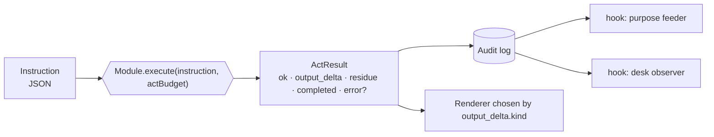

# 02 — The Module Contract

**Status:** normative · **Version:** 1.0 · **Implementations:** `buhera-os/crates/buhera-registry/src/contract.rs` (Rust), `buhera-os/registry-ts/src/contract.ts` (TypeScript)

The key words MUST, MUST NOT, SHOULD and MAY are used as in RFC 2119.

## 1. Purpose

Every engine in the Buhera federation, whether an SBS circuit solver, a timekeeping kernel, a repository tracker or a DSL interpreter, is exposed to the rest of the system through one shape: the **module**. A module takes an **instruction**, performs one **act**, and returns an **ActResult**. The registry (spec 03) dispatches acts, audits them, and notifies observers. Nothing else is shared between modules.

The contract is the same in both host languages, field for field, for three reasons:

1. An act dispatched in the browser and an act dispatched in the Rust OS are audited identically, so traces can be compared and replayed across hosts.
2. The TypeScript host can **forward** an act to a Rust-hosted module over HTTP without any translation layer (binding kind `remote`, spec 07).
3. Conformance can be checked mechanically against one catalogue (spec 05).



## 2. Values

### 2.1 Instruction

An instruction is any JSON value. Two conventional shapes are recognised by every module:

| Shape | Meaning |
|---|---|
| `string` | DSL source text, or a bare verb (`"demo"`, `"list"`, `"status"`) |
| `{ "kind": string, …fields }` | A named operation with typed fields |

- **I1.** Every module specification MUST enumerate the instruction shapes it accepts, with field names and types.
- **I2.** A module MUST answer any other shape with the standard *invalid instruction* result (§2.2.3). It MUST NOT throw or panic on malformed input.
- **I3.** An instruction MUST survive a JSON round trip unchanged. Functions, class instances and binary buffers are not instructions. Binary payloads travel base64-encoded in a string field.
- **I4.** The empty string, `null`, and `"demo"` SHOULD run the module's canonical demonstration when the module has one. This lets a terminal user discover a module by dispatching it with no arguments.

### 2.2 ActResult

```jsonc
{
  "ok": true,                // did the act achieve what was asked?
  "output_delta": {          // renderable payload, or null (see R2 in spec 03)
    "kind": "sbs_result",    // names the renderer
    "...": "module-specific"
  },
  "residue": 19,             // work remaining, in the module's declared unit
  "completed": true,         // finished within the act budget?
  "error": "…"               // present iff ok is false
}
```

- **A1.** `ok` is `true` iff the act achieved what the instruction asked for. A *legitimate negative outcome* that the engine returns as a typed result (an HFQ `refused` verdict, a ladder `subfloor` refusal, a windtunnel `incomplete` verdict) is still `ok: true`. The act worked, and the answer is "no". `ok: false` is reserved for acts that could not be performed: invalid instruction, compile failure, engine error, or bridge unreachable.
- **A2.** `output_delta` MUST be an object with a string `kind` whenever the module returns normally. `kind: "text"` with `lines: string[]` is the universal fallback every host can render. Each module specification lists its `kind` values, and the catalogue records them (`output_kinds`).
- **A3.** `residue` is a finite, non-negative number in a unit the module's specification declares. `0` means *nothing remains*. It MUST NOT be used to mean *unknown*. A module with no meaningful notion of remaining work declares its residue as a count of something real that the act produced (nodes + edges compiled, verdicts issued, …) and says so. No module may present a count as a distance-to-solution.
- **A4.** `completed` is `false` only when the module honoured the act budget and stopped early in a resumable state. Modules that do not support partial acts always return `true`.
- **A5.** `error` is present iff `ok` is false. It is a short machine-readable reason (`"invalid instruction"`, `"compile failed"`, `"bridge unreachable"`, or the engine's first diagnostic). Human-readable detail goes in `output_delta.lines`.

#### 2.2.1 Constructors

Both libraries provide the same constructors so results are uniform:

| Rust (`ActResult::…`) | TypeScript | Produces |
|---|---|---|
| `done(delta, residue)` | `done(delta, residue)` | `{ok:true, output_delta:delta, residue, completed:true}` |
| `text(lines, residue)` | `text(lines, residue)` | `done({kind:"text", lines}, residue)` |
| `fail(lines, error)` | `fail(lines, error)` | `{ok:false, output_delta:{kind:"text",lines}, residue:0, completed:true, error}` |
| `invalid(id, expected)` | `invalid(id, expected)` | `fail(["<id>: instruction must be <expected>"], "invalid instruction")` |

#### 2.2.2 Delta conventions

- A delta SHOULD carry a one-line `summary` string, which the audit viewer and text fallbacks use.
- A delta that wraps an engine result SHOULD carry the engine's result object unmodified under a named field (`result`, `circuit`, `metrics`, …). This keeps the engine's own renderers usable. Adapters MUST NOT rename engine fields.
- Large arrays (samples, traces) MAY be truncated in the delta if the full data is available on request through another instruction kind. Truncation MUST be signalled with a `truncated: true` field.

#### 2.2.3 The invalid-instruction result

```json
{ "ok": false,
  "output_delta": { "kind": "text", "lines": ["<id>: instruction must be <expected>"] },
  "residue": 0, "completed": true, "error": "invalid instruction" }
```

### 2.3 Descriptor

```jsonc
{
  "id": "sbs",
  "description": "one paragraph",
  "instructions": ["dispatch(\"sbs\", \"demo\")", "…"],   // example invocations
  "dsl": "sbs",                // optional: the language this module executes
  "binding": "native"          // native | remote | bridge (spec 07)
}
```

- **D1.** `id` MUST equal the module's registry id.
- **D2.** `binding` MUST equal the catalogue's binding for the running host (conformance rule C1).
- **D3.** If `dsl` is present it MUST equal the catalogue's `dsl` for the module (C3).

### 2.4 OutputCell

`outputCell(instruction) → { kind }` names the renderer cell a host must allocate before dispatch. The default is `"<id>_cell"`.

## 3. The Module interface

```rust
pub trait Module: Send {
    fn id(&self) -> &str;
    fn describe(&self) -> Descriptor;
    fn execute(&mut self, instruction: &Instruction, act_budget: u32) -> ActResult;
    fn output_cell(&self, instruction: &Instruction) -> OutputCell { /* "<id>_cell" */ }
}
```

```ts
interface Module {
  readonly id: string;
  describe(): Descriptor;
  execute(instruction: Instruction, actBudget: number): Promise<ActResult> | ActResult;
  outputCell?(instruction: Instruction): OutputCell;
}
```

- **M1. Wrap, never reimplement.** An adapter calls the engine's real public API. If the engine is unavailable in a host, the binding is `remote`, `bridge` or `none`. It is never a re-implementation. This is the load-bearing rule of the federation: a number a user sees came from the engine that the paper describes.
- **M2. No hidden state.** State that persists between acts (a vaHera kernel, a pylon cluster, a zangalewa pairing) lives in the module value (`&mut self` in Rust, closure or object fields in TS), never in a process global the registry cannot see. Registering a fresh module value gives a fresh state.
- **M3. Determinism.** Given the same instruction sequence and the same seed, a module MUST produce the same results. Sources of nondeterminism (wall clock, network, GPU float order) are declared in the module specification's *Side effects* section.
- **M4. Side effects are declared.** Network I/O, filesystem access, process spawning, and wall-clock reads are listed in the module's specification and in its catalogue row. A module with undeclared side effects is non-conformant.
- **M5. Rust `execute` is synchronous.** An engine with an async API is driven to completion inside `execute`, on a runtime owned by the module. The TS `execute` may be async.
- **M6. Budgets.** `act_budget ≥ 1`. Modules with iterative engines SHOULD map one budget unit to one engine step (pylon: one agent tick; tempus: one simulator batch; zangalewa-dsl: one draft) and report `completed: false` with the remaining work in `residue` when they stop early.

## 4. Equivalence across hosts

Two hosts are *contract-equivalent* for a module when, for every instruction in the module's conformance set (listed in its specification), they return ActResults that are equal after erasing `wall_clock_ms`, `timestamp`, and any field the module specification marks *host-local*. For example, the SBS `backend` field reads `"webgl2"` or `"cpu"`. Modules with both a `native` Rust and a `native` TS binding MUST be contract-equivalent. The per-module *Parity* section states the tolerance for floating-point fields.
