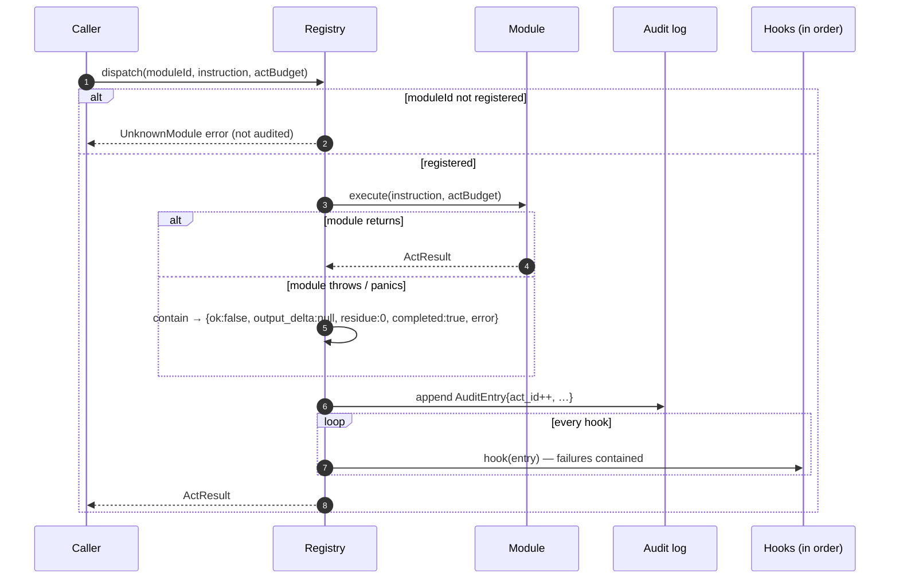

# 03 — The Module Registry

**Status:** normative · **Version:** 1.0 · **Implementations:** `buhera-registry::Registry` (Rust), `Registry` in `@buhera/registry` (TypeScript), and the long-grass singleton facade `long-grass/src/lib/modules/registry.js`

## 1. Purpose

The registry is the federation's one executor funnel. Every act, whether typed in a terminal, run in a tutorial cell, generated from natural language, or forwarded by another host, goes through `dispatch`. That single funnel is what makes the audit log complete and lets observers (the purpose-carry feeder, the desk observer, tracing) see everything without each module cooperating.



## 2. Operations

| Operation | Rust | TypeScript | Semantics |
|---|---|---|---|
| register | `register(Box<dyn Module>) -> Option<Box<dyn Module>>` | `register(mod) → Module \| null` | bind under `mod.id`; replace and return any previous binding |
| unregister | `unregister(id) -> Option<…>` | `unregister(id) → Module \| null` | remove binding |
| ids | `ids() -> Vec<String>` | `ids() → string[]` | sorted |
| list | `list() -> Vec<Descriptor>` | `list() → Descriptor[]` | sorted by id |
| dispatch | `dispatch(id, instr, budget) -> Result<ActResult, DispatchError>` | `dispatch(id, instr, budget=1) → Promise<ActResult>` (throws `UnknownModuleError`) | §3 |
| audit log | `audit_log() -> &[AuditEntry]` | `auditLog() → AuditEntry[]` (copy) | oldest first |
| clear audit | `clear_audit_log()` | `clearAuditLog()` | act ids continue |
| hook | `on_dispatch(f) -> HookId`, `remove_hook(id)` | `onDispatch(f) → unregister()` | §3 R4 |

## 3. Dispatch semantics

- **R1. Unknown module.** Dispatching to an unregistered id is a caller error. Rust returns `Err(DispatchError::UnknownModule(id))` and TS throws `UnknownModuleError`. Nothing is audited.
- **R2. Containment.** If `execute` throws (TS) or panics (Rust), the registry records and returns `{ok:false, output_delta:null, residue:0, completed:true, error:<message>}`. This is the only path on which `output_delta` is null. Every contained failure is a defect in the module: conformant modules return `fail(…)` themselves.
- **R3. Act ids.** Act ids start at 1, increase by exactly one per completed dispatch (including contained failures), and are never reused, even after `clear_audit_log`.
- **R4. Hooks.** After the entry is appended, every registered hook is called with it, in registration order. A hook that throws or panics is contained and logged. It does not prevent later hooks from running and does not change the caller's result. Hooks MUST NOT dispatch re-entrantly into the same registry.
- **R5. Replacement.** `register` with an id already bound replaces the binding and returns the previous module. Hot reload and test doubles rely on this.
- **R6. State.** The registry owns module values. State persists between acts for as long as the binding lives (spec 02, M2).

## 4. Conformance tests

Both libraries MUST pass the same seven cases. They live in `buhera-registry/tests/registry_semantics.rs` and `registry-ts/test/registry-semantics.test.ts`:

| Case | Asserts |
|---|---|
| R1 | unknown id → error, audit log empty |
| R2 | throwing module → exact contained result, one audit entry |
| R3 | ids 1,2 then clear then 3 |
| R4 | hooks a, (failing), b fire as `a1 b1`; after removing b, `a2` |
| R5 | re-register returns previous; new state visible |
| R6 | a counter module reports 3 after three acts; budget recorded; timestamp ends in `Z` |
| D1 | DSL registry validates, reports line numbers, rejects unknown ids, and resolves extensions case-insensitively (spec 04) |

## 5. AuditEntry

```jsonc
{
  "act_id": 42,
  "module_id": "tempus",
  "instruction": { "kind": "simulate", "source": "…", "seed": 42 },
  "act_budget": 1,
  "result": { /* ActResult */ },
  "wall_clock_ms": 3,
  "timestamp": "2026-09-28T21:04:05.123Z"   // RFC 3339 UTC, millisecond precision
}
```

The Rust timestamp formatter is tested against JS `Date.prototype.toISOString` output at three instants, including a leap day.

## 6. Hosts and singletons

A **host** is a process that owns one registry: the long-grass browser runtime, a long-grass API route, the `buhera-gateway` server, or a `buhera-os` binary. Each host builds its registry once at startup:

- **TypeScript:** `createFederation(options)` in `@buhera/registry/modules` returns `{ registry, dsls }` populated with every TS-bound module. long-grass's `bootstrapFederation()` calls it and then registers its host-local modules (vahera, purpose-carry, desk, …) on top.
- **Rust:** `buhera_modules::federation(options)` returns `(Registry, DslRegistry)` populated with every module whose cargo feature is enabled.

The long-grass facade `src/lib/modules/registry.js` keeps its historical free functions (`register`, `dispatch`, `onDispatch`, `getAuditLog`, …) as thin delegates to one `Registry` instance, so the 25 existing adapters and every page keep working unchanged.
