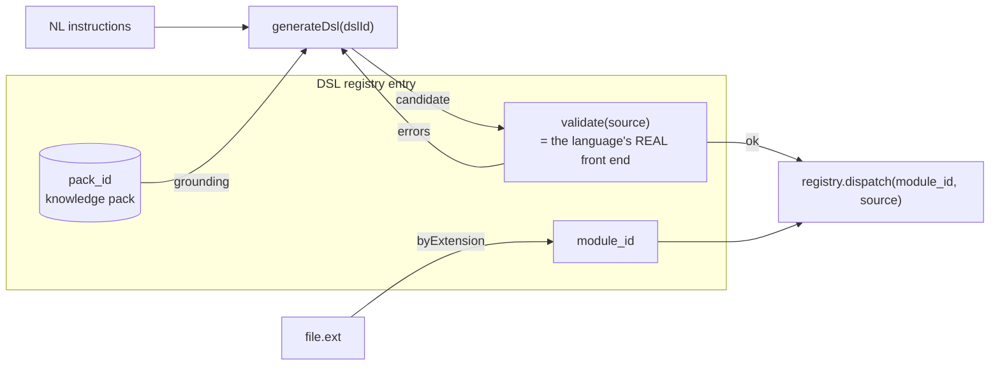

# 04 — The DSL Registry

**Status:** normative · **Version:** 1.0 · **Implementations:** `buhera-registry::dsl` (Rust), `DslRegistry` in `@buhera/registry` (TypeScript). Supersedes the single-entry `DSL_REGISTRY` object in `long-grass/src/lib/purpose/dsl/validators.js`, which is now a facade over the TS `DslRegistry`.

## 1. Purpose

Many Buhera modules own a language: SBS circuits, HFQ plans, the zangalewa DSL, ndombolo, vaHera, Shakespeare, honjo, shapeshifter. The DSL registry is the table that lets language-agnostic machinery treat them uniformly. Three consumers depend on it:

1. **Generation** (`dsl-generator.js`): natural-language instructions → generated source → *validated by the language's own compiler* → repaired until it passes. The registry supplies the validator and the grounding knowledge pack.
2. **Routing:** a validated script, or a file dropped into a terminal, is dispatched to the module that executes it. The registry supplies `module_id`, and resolves files by extension.
3. **Editors:** squiggles in a DSL editor come from `validate` without running anything.



## 2. Entry

| Field | Type | Meaning |
|---|---|---|
| `id` | string | language id, e.g. `"sbs"` |
| `label` | string | display name |
| `extension` | string | conventional extension including the dot, e.g. `".sbs"` |
| `module_id` / `moduleId` | string | registry module that executes validated source |
| `pack_id` / `packId` | string | knowledge pack that grounds generation (`long-grass/knowledge-packs/<pack_id>/`) |
| `validate` | `(source) → Validation` | the language's real front end, normalised |

```jsonc
// Validation
{ "ok": false, "errors": [ { "message": "expected '{' after circuit name", "line": 3, "column": 17 } ] }
```

## 3. Rules

- **L1. Real front end.** `validate` MUST invoke the language's own lexer, parser and, where one exists, static checker (HFQ's capability check, SCOPE's attainability check). It MUST NOT reimplement a grammar. A source is valid iff its own compiler accepts it.
- **L2. Purity.** `validate` MUST NOT execute the program, touch the network, or mutate module state. It MAY run a compile phase that is itself pure.
- **L3. Normalisation.** Compilers report errors in different shapes: a thrown error with `"line N:"` in the message, `{valid, errors}`, `{ok, errors}`, `Result<_, Vec<Diag>>`. Each entry's validator converts to `Validation` and preserves the compiler's wording. Positions are 1-based. `fromThrowing(parse)` (TS) and `line_from_message` (Rust) cover the common throwing case.
- **L4. At least one diagnostic.** `ok: false` implies `errors.length ≥ 1`.
- **L5. Unknown id is a programming error.** `validate(unknownId, …)` throws (TS) or returns `Err(UnknownDsl)` (Rust). Invalid source is never an error; it is a `Validation`.
- **L6. Routing integrity.** `module_id` MUST name a module registered on the same host, or one that host reaches by a `remote`/`bridge` binding. `pack_id` SHOULD name an existing knowledge pack. A language without a pack cannot be a generation target, but it can still be validated and routed.
- **L7. One language, one validator per host.** A language MAY carry validators on both hosts. When it does, the two MUST agree on `ok` for every script in the language's conformance corpus (its module specification lists the corpus).

## 4. Registered languages

The authoritative list is the `dsls` array of the catalogue (spec 05). The site renders it as a table. Per-language grammars are in each module's specification under *Language*.

## 5. Knowledge packs

A knowledge pack is `long-grass/knowledge-packs/<id>/manifest.json` plus Markdown references. For every language added by this specification revision, the pack's `reference.md` is generated from the *Language* section of the module's specification. The specification is the source, and the pack is a projection of it. This keeps generation grounded in the same text that defines the language, and applies the empty-dictionary rule: packs contain grammar and worked examples, never domain facts.
