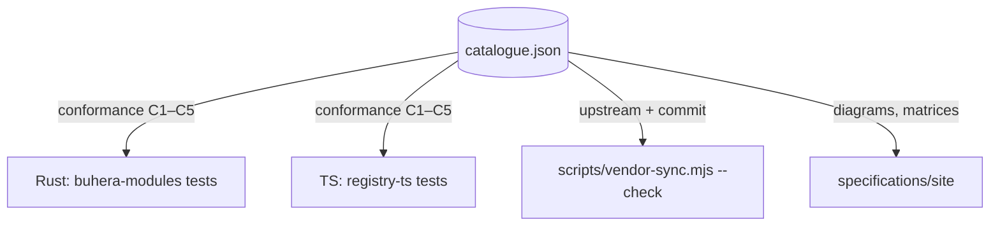

# 05 — The Catalogue

**Status:** normative · **Version:** 1.0 · **File:** `specifications/registry/catalogue.json` · **Schema tag:** `buhera.catalogue/1`

## 1. Purpose

The catalogue is the single machine-readable statement of *what the federation is*:

- which modules exist, and in which architectural layer;
- which language, if any, each one executes;
- where each engine's source of truth lives, and the exact commit of the vendored copy;
- how each host language reaches each engine (`native`, `remote`, `bridge`, `none`);
- what each module's `residue` counts, and which `output_delta.kind`s it emits.

Three things consume it:



The two registry libraries do **not** read the catalogue at build time. The OS stays standalone. Their test suites load it and assert conformance, so a library cannot drift from the specification without a failing test.

## 2. Schema

```jsonc
{
  "schema": "buhera.catalogue/1",
  "modules": [
    {
      "id": "sbs",                              // registry id
      "name": "Systems Biology Shaders",
      "layer": "science",                       // language | science | runtime | observation | coordination
      "summary": "one sentence",
      "dsl": "sbs",                             // or null
      "upstream": [{
        "repo": "fullscreen-triangle/hegel",
        "path": "consequences/src/lib/sbs",
        "language": "js",                       // rust | ts | js
        "commit": "63d09c4",
        "vendored_at": "long-grass/vendor/sbs"  // omitted when not vendored
      }],
      "bindings": { "rust": "native", "ts": "native" },   // native | remote | bridge | none
      "output_kinds": ["sbs_result"],
      "residue": "nodes + edges of the compiled circuit",
      "side_effects": ["webgl2 (optional, CPU fallback)"],
      "spec": "specs/sbs.md"
    }
  ],
  "dsls": [
    { "id": "sbs", "label": "SBS", "extension": ".sbs",
      "module_id": "sbs", "pack_id": "sbs", "validators": ["rust", "ts"] }
  ]
}
```

## 3. Conformance rules

For a host *H* ∈ {`rust`, `ts`} with module registry *R* and DSL registry *D*:

| Rule | Statement |
|---|---|
| **C1** | Every module whose `bindings[H] ≠ none` is registered in *R*, and its descriptor's `binding` equals `bindings[H]`. |
| **C2** | Every module registered in *R* appears in the catalogue with `bindings[H] ≠ none`. No unlisted members. |
| **C3** | A registered module that declares `dsl` declares the catalogue's `dsl`. |
| **C4** | Every language whose `validators` includes *H* is registered in *D* and routed to the catalogue's `module_id` and `pack_id`. |
| **C5** | Every language registered in *D* appears in the catalogue with *H* among its `validators`. |

`conformance(catalogue, host, R, D)` returns a list of violations, one string per violation, identically worded in both libraries. The conformance test asserts the list is empty for the full federation build (`--all-features` in Rust, `createFederation()` with all engines in TS).

Host-local modules (long-grass's `vahera`, `purpose-carry`, `desk`, …) are registered by the host *after* conformance is checked on the library federation. The catalogue governs the shared library federation, not every module a host chooses to add.

## 4. Change management

- Adding a module = one catalogue row + one spec file + adapters on each non-`none` host + vendored engine (spec 06). The conformance tests fail until all four exist.
- Changing a binding (e.g. `none` → `remote` once the gateway exposes a module) is a one-field edit plus the adapter.
- `commit` is updated only by `scripts/vendor-sync.mjs`, never by hand.
