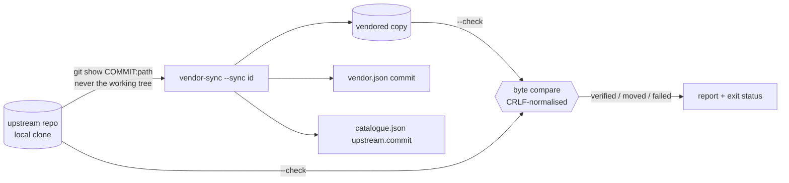

# 06 — Sourcing: how engines enter the federation

**Status:** normative · **Tool:** `scripts/vendor-sync.mjs` · **Manifest:** `specifications/registry/vendor.json`

## 1. The rule

Every engine is **vendored**. Its source is copied into this repository from its upstream repository at a **recorded commit**, byte-exact, and checked mechanically. Nothing is fetched at build time, and nothing is referenced by a path outside this repository.

This follows from three constraints:

1. **Standalone builds.** `buhera-os` builds with no sibling checkouts. long-grass deploys from its own directory (Vercel), so its engines live under `long-grass/vendor/`.
2. **Reproducibility.** A build is a function of this repository's commit. An engine changes only by an explicit, reviewable sync.
3. **Honesty.** The copy is the engine the paper describes. Byte-exactness is checked rather than assumed.

## 2. The manifest

`vendor.json` entries:

| field | meaning |
|---|---|
| `id` | entry name (`sbs-js`, `wt-dsl`, …) |
| `module` | catalogue module it serves (`null` for host infrastructure) |
| `repo` | `owner/repo` |
| `from` | path inside upstream |
| `to` | path in this repository |
| `mode` | `tree` (directory), `file`, or `build` (a build product, e.g. `dist/`) |
| `commit` | full SHA the copy corresponds to |
| `exclude` | upstream paths deliberately not vendored |
| `local` | vendored paths carrying recorded local changes; skipped by the byte check, and each justified in `note` |
| `note` | why the entry looks the way it does |

Local clone locations come from the `clones` map (relative to this repository), overridable with `BUHERA_CLONE_<REPO>`.

## 3. Operations

- `--check` (default).
  - For each entry, the tool compares every upstream file at `commit` with the vendored file, byte-for-byte after CRLF normalisation.
  - It reports extra vendored files, and whether upstream `HEAD` has **moved** under `from` since `commit`.
  - Exit status: 1 on any integrity failure, 0 otherwise. "moved" is information: it means a sync is available.
  - `build` entries cannot be byte-verified, so they report only whether their source moved.
- `--sync <id…|all>`. Re-copies from upstream **HEAD** (committed content only) and records the new commit in both manifests. Entries with `local` changes or `build` mode refuse, because those need a human.
- `--list`.

## 4. Rust manifests

A vendored Rust crate keeps upstream `src/` byte-exact, with a **local `Cargo.toml`**. Upstream crates inherit dependency versions from workspaces this repository does not have. A local manifest also lets the federation:

- declare only the dependencies the library actually uses. `hegel/sbs` declares 17; the library uses two.
- skip upstream CLIs (`autobins = false`).

Each local manifest says so in its header comment.

## 5. State at this revision

`node scripts/vendor-sync.mjs --check`, run 2026-09-29: **11 verified, 1 built (pylon dist; source unchanged), 0 failed.**

This includes long-grass's pre-existing copies of SBS, HFQ and the scheduler, which had no recorded provenance before. All three were found to match upstream exactly, except SBS's recorded local re-exports.

## 6. Our own library

`@buhera/registry` is authored in `buhera-os/registry-ts`. long-grass consumes a mirror at `long-grass/vendor/registry`, written by `scripts/sync-registry-ts.mjs`, whose `--check` mode fails on drift. The wasm artifact is installed by `scripts/build-wasm.mjs` into `registry-ts/wasm/` and `long-grass/public/wasm/`, and the script prints the artifact's SHA-256.
