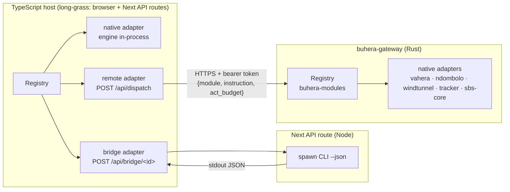

# 07 — Bindings: how a host reaches an engine

**Status:** normative · **Version:** 1.0

A module's *binding* on a host says where its engine runs relative to the registry that dispatches to it. It is recorded per host in the catalogue (`bindings.rust`, `bindings.ts`) and reported by the module's descriptor (`binding`).



## 1. The four kinds

| Kind | Engine location | Transport | When to use |
|---|---|---|---|
| `native` | same process | function call | the engine exists in the host's language (or compiles to it) |
| `remote` | another host's registry | HTTP `POST /api/dispatch` on `buhera-gateway` | the engine exists only in Rust and must be reachable from the browser |
| `bridge` | a CLI binary on the machine running a Next API route | `spawn` → JSON on stdout | the engine is a CLI that shells out, touches the local filesystem, or must not run on a shared server |
| `none` | not available on this host | — | stated explicitly with a reason in the module spec |

## 2. `remote` — the gateway dispatch protocol

The gateway already routes work by capability (`/api/run`). This specification adds one route that exposes the Rust registry. It is an additive change: no existing route changes.

### 2.1 Request

```http
POST /api/dispatch
Authorization: Bearer <session token>
Content-Type: application/json

{ "module": "sbs-core", "instruction": { "kind": "observe", "perturbations": [{ "edge": 0, "factor": 0.1 }] },
  "act_budget": 1 }
```

### 2.2 Response

```jsonc
// 200 — the act ran (ok may still be false: that is the module's verdict)
{ "executed_on": "gateway", "note": null,
  "result": { "ok": true, "output_delta": { "kind": "sbs_core_result", "...": "..." },
              "residue": 0.8825, "completed": true },
  "act_id": 17 }
// 404 — { "error": "dispatch: unknown module \"x\"" }       (R1 on the remote host)
// 401 — unauthenticated
```

### 2.3 Rules

- **B1.** `/api/dispatch` executes on the gateway's own registry, one per account (`AppState.federations`), built by `buhera_modules::federation` with the features the gateway enables: vahera, ndombolo, windtunnel, tracker and sbs-core. A module not in that registry is `404`. Routing to a paired catalyst is future work, blocked on the same relay `/api/run` still lacks. When the relay lands, the module id becomes the routing capability. `GET /api/modules` lists what `/api/dispatch` can reach (modules and languages).
- **B2.** The remote adapter returns the remote `result` verbatim. Transport failures (network error, non-2xx) become `fail(["<id>: <reason>"], "remote unreachable" | "remote unauthorized" | "remote unroutable")`. They are never thrown.
- **B3.** The act is audited on **both** hosts: on the remote host by its registry, and locally by the local registry's dispatch of the remote adapter. The local delta carries `executed_on` so the audit trail shows where the work ran.
- **B4.** State of a remote module lives on the remote host, scoped per account session. Two browser tabs of one account share it. That is the same scoping `/api/run` already uses for the vaHera kernel.
- **B5.** The gateway MUST NOT expose modules whose side effects read the operator's filesystem to arbitrary accounts. Such modules are `bridge` in TS and registered on the gateway only for catalyst routing (never `Route::Gateway`). The tracker's filesystem operations are in this class: the gateway builds its federation with `filesystem: false`.

### 2.4 The second remote transport: the zangalewa interceptor broker

`zangalewa-dsl` in the TS host is `remote` through a different transport. The zangalewa interceptor broker (`127.0.0.1:4319`) relays opaque jobs to the user's own `zangalewa connect` agent, which holds the model keys. The pairing is a single-use code. Rules B2 (results, not throws) and B3 (`executed_on`) apply unchanged. See `specs/zangalewa-dsl.md`.

## 3. `bridge` — the CLI protocol

*Status: specified, not used by any catalogue module in this revision.* The one CLI in play, `wt` for windtunnel `measure`, is spawned by the Rust module itself. long-grass's host-local `interceptor` and `spraypaint` modules already follow this pattern through their own API routes. A bridge adapter posts `{ instruction, act_budget }` to `/api/bridge/<id>` on the Next server. That route spawns the module's CLI with `--json`, writes the instruction to stdin, and reads exactly one JSON `ActResult` from stdout. The existing `interceptor-run` route is the model.

- **B6.** The CLI path comes from an environment variable named in the module spec (e.g. `BUHERA_TRACKER_BIN`). When the variable is unset, the route returns `fail(["<id>: bridge binary not configured (set VAR)"], "bridge unavailable")`.
- **B7.** The spawned process gets a wall-clock timeout (default 30 s), no shell, and an argument vector that never interpolates user text.
- **B8.** Bridges are disabled when `process.env.VERCEL` is set, because serverless functions have no persistent binaries or filesystem. The adapter then falls back to `remote` if the catalogue lists a Rust binding, or fails with `bridge unavailable`.

## 4. `native` in the browser, and Rust in the browser via wasm

The pure Rust modules (ndombolo, windtunnel, tracker) are compiled, **adapter and all**, to one `wasm32-unknown-unknown` module: `buhera-os/crates/buhera-wasm`, built and installed by `scripts/build-wasm.mjs`. It exposes a C-ABI JSON interface (`bw_describe`, `bw_dispatch`, `bw_validate`) and needs no wasm-bindgen. The TS registry calls it in-process, so the binding is `native`. There is one implementation, compiled twice, so the Rust and TS hosts are contract-equivalent by construction.

- **W1.** The wasm instance executes through `Registry::execute_unaudited`. The calling TS registry audits, so each act is recorded once. That path reads no clock, which matters because `std::time::Instant::now` panics on `wasm32-unknown-unknown`. This is also why `sbs-core`, whose engine reads `Instant`, is `remote` and not wasm.
- **W2.** A trap poisons the instance. The loader re-instantiates from the compiled module, then surfaces the error, which the registry contains (R2).
- **W3.** In the browser the module registers at mount and loads the ~640 KB binary on first use (`makeLazyWasmModules`). A failed load is an `engine unavailable` result.
- **W4.** Server-side validation (the DSL registry in `/api/dsl-generate`) loads the same binary synchronously (`loadWasmEngineSync`).
- **W5.** Operations needing a filesystem (tracker `character_at`, `list`) answer `unavailable on this host` in wasm and on the gateway.

### 4.1 TS-native engines in the browser

A TS-native engine MAY depend on browser APIs (WebGL2, `performance.now`). The adapter MUST degrade rather than throw when the API is missing: SBS falls back to its CPU solver and reports `backend: "cpu"`. Node-only engines (filesystem, child processes) are never TS-`native`; they are `bridge`.
