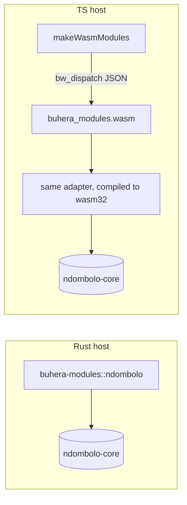

# ndombolo — the Turbulance runtime

| | |
|---|---|
| **Registry id** | `ndombolo` |
| **Layer** | language |
| **Language** | `turbulance` (`.tb`; `.ndo` notebooks) |
| **Upstream** | `fullscreen-triangle/kwasa-kwasa` · `ndombolo/crates/ndombolo-core` @ `674b965` |
| **Vendored at** | `buhera-os/vendor/ndombolo-core/{src,tests}` (byte-exact) |
| **Rust binding** | native: `buhera-os/crates/buhera-modules/src/ndombolo.rs` |
| **TS binding** | native, via wasm: the same Rust adapter in `buhera-wasm`, loaded by `registry-ts/src/modules/rust-wasm.ts` |

## 1. Purpose

ndombolo is kwasa-kwasa's deterministic runtime and notebook for **Turbulance**. A script is a sequence of *cells* separated by `// ---` lines, or the `turbulance` code fences of a `.ndo` Markdown notebook. Each cell runs against one accreting session. The run yields:

- a per-cell **store delta**: names added or updated, with the rendered value and its tag;
- a **rule trace**: one JSON event per evaluator rule application (`declare-item`, `assign`, `support`, `resolve-motion`, …);
- **proposition scores**: a noisy-or aggregation of `support` and `contradict` verdicts per motion;
- a **static contact graph** over declared items, computed without execution.

The paper behind it (*Ndombolo: A Semantic Runtime Graph*) frames the script as a causal knowledge graph whose only propagator is a deterministic compiler. The rules never consult a clock, an address, a random source or a model. A learning model may read the record but never enters the propagation path.

## 2. Upstream and vendoring

- `ndombolo-core` is a pure library whose only dependencies are `serde` and `serde_json` with `preserve_order`. It has no I/O, is not async, and typechecks for `wasm32`.
- `src/` and `tests/` are vendored verbatim.
- The tests are the upstream **differential oracle suites**, which check the Rust port against the frozen Python prototype over 44 token, 55 AST, 66 evaluation and 50 graph scripts. They run in the Buhera workspace (`cargo test -p ndombolo-core`: 41 unit + 11 differential, all passing).
- The upstream `ndombolo` binary (record file, editor server, Ollama observer) is **not** vendored. The module never writes files.

## 3. Language

Turbulance, the fragment ndombolo implements. Layout is significant: a line ending in `:` opens a block; indentation closes it, with tabs counting as 4 columns. Brackets suspend layout. Comments are `//` or `#`.

```
program    := cell ("// ---" cell)*
statement  := "item" NAME "=" expr                      -- define in current scope
            | NAME "=" expr                             -- assign (defines if unbound)
            | "funxn" NAME "(" params? ")" ":" block    -- closure
            | "point" NAME "=" map                      -- confidence from certainty|confidence, clamped [0,1]
            | "proposition" NAME ":" block              -- motions declared first; verdicts only inside
            | "motion" NAME "(" STRING ")"
            | ("support" | "contradict") NAME ("with_confidence" "(" expr ")")?
            | "inconclusive" NAME
            | "hypothesis" NAME ":" block
            | "given" expr ":" block ("otherwise" ":" block)?
            | "within" expr ":" block                   -- a map's keys are bound in the block
            | "for" "each" NAME "in" expr ":" block
            | "considering" ("all" | "these")? NAME "in" expr ":" block
            | "while" expr ":" block                    -- capped at 100 000 rounds
            | "return" expr? | "ensure" expr | "resolve" expr | expr
expr       := pipe ;  pipe := or ("|>" or)*   -- x |> f  ≡  f(x)
or / and   := "or" "||" / "and" "&&"          -- short-circuit, return Bool
compare    := == != < <= > >=                  -- equality compares rendered values
arith      := + - * / %                        -- / is float division; + concatenates strings, appends lists
postfix    := call "(" args ")" | "." field | "[" index "]"
literal    := NUMBER | STRING | true | false | none | "[" … "]" | "{" key ":" expr, … "}"
builtins   := print len sum min max abs round  -- numeric varargs; sum/min/max reject a list argument
```

Semantics that surprise:

- `considering x in xs` without `all` iterates **only the first element**.
- `1 == true`, because equality compares rendered values.
- `from` is reserved, so use `e["from"]` for a field of that name.
- Loose keywords (`allow`, `research`, `cause`, `goal`, `metacognitive`, `resolution`, `import`) parse to no-ops, and **their bodies are skipped**.
- `cycle`, `drift`, `flow`, `roll`, `until`, `settled`, `over` and `on` in statement position are parse errors.
- The session step budget (200 000 steps) is cumulative across cells.

Valid examples (each is checked by the language's own front end in `long-grass/test/knowledge-packs.test.mjs`):

```turbulance
item threshold = 0.7
item readings = [0.4, 0.8, 0.9]

// ---

funxn above(xs, t):
    item hits = 0
    considering all x in xs:
        given x > t:
            hits = hits + 1
    return hits

// ---

proposition Signal:
    motion Strong("enough readings clear bar")
    given above(readings, threshold) >= 2:
        support Strong with_confidence(0.9)
```

```turbulance
funxn grow_until(od_start, threshold, step_gain, max_steps):
    item od = od_start
    item steps = 0
    while od < threshold:
        given steps >= max_steps:
            return {od: od, steps: steps, reached: false}
        od = od + step_gain
        steps = steps + 1
    return {od: od, steps: steps, reached: true}

item fast = grow_until(0.36, 0.40, 0.06, 1)
print("fast:", fast.od, fast.steps, fast.reached)
```

## 4. Instructions

| Instruction | Effect |
|---|---|
| `"demo"`, `""`, `null` | Run the manuscript's worked example (the first script above) |
| `string` | Cell-separated Turbulance source; run every cell in a fresh session, stop at the first failing cell |
| `{kind:"run", source}` | Same as a string |
| `{kind:"ndo", document}` | Run a `.ndo` notebook's `turbulance` fences in order; return the notebook with each cell's `output` fence spliced in (as `ndombolo run` would write it, without writing) |
| `{kind:"graph", source}` | Static contact graph only; nothing is executed |
| `{kind:"validate", source}` | Lex and parse every cell; returns a `dsl_validation` delta |

## 5. Output deltas

`ndombolo_result`:
```jsonc
{ "kind": "ndombolo_result", "summary": "ndombolo: ran 3 cell(s), 24 event(s)",
  "cells": [{ "index": 0, "first_line": 4, "ok": true, "error": null | { "phase": "parse|run|return", "message": "line N: …", "line": N },
              "output": ["printed line"], "store_delta": { "x": { "change": "added|updated", "value": …, "tag": "num|str|…", "from"?: … } },
              "trace": [ /* rule events */ ] }],
  "stopped_at": null | <cell index>, "store": { … }, "events": 24,
  "propositions": [{ "name": "Signal", "motions": [{ "name": "Strong", "text": "…", "score": 0.9 }], "verdicts": [{ "motion", "stance", "confidence", "line" }] }],
  "graph": { "items": [...], "contacts": [...], "item_count": n, "contact_count": m },
  "cells_that_did_not_parse": [], "document"?: "<.ndo with outputs>" }
```
`ndombolo_graph` has `{graph, cells_that_did_not_parse}`. `dsl_validation` has `{dsl, ok, errors}`.

Proposition scores appear **only** here. Upstream keeps them unserialised, so no other surface exposes them.

## 6. Residue

The number of **trace events deposited** by the act. This is a content count. ndombolo's theory forbids a success/failure verdict (invariant B6), so there is no distance to report. A stop at a failing cell is `ok: true` with `stopped_at` set. Tutorials stop by design, and that outcome is the answer.

## 7. Bindings



There is one adapter, compiled twice, so the two hosts are contract-equivalent by construction (spec 02 §4). The TS test `ndombolo (wasm): demo scores the manuscript proposition at 0.9` and the Rust test `ndombolo_demo_scores_the_manuscript_proposition` assert the same facts.

## 8. Side effects and determinism

None. Every act runs in a fresh session, and output is byte-deterministic.

## 9. Hazards

- **`preserve_order` unification.** Cargo unifies `serde_json/preserve_order` into every build that includes this crate. The gateway and the whole workspace now render JSON objects in insertion order, not sorted. The full workspace suite (119 tests) passes under this, so no current behaviour depends on key order. New code MUST NOT assume sorted keys.
- `Session` is `!Send` (`Rc<RefCell>`). The adapter creates and drops it inside `execute`, never across acts.
- `act_budget` is not mapped. The engine's step limit is a per-session constant, and each act is one fresh session.

## 10. Conformance

- `buhera-modules/tests/conformance.rs`:
  - `ndombolo_demo_scores_the_manuscript_proposition`
  - `ndombolo_stops_at_a_failing_cell_and_reports_it`
  - `ndombolo_ndo_documents_get_output_blocks_spliced`
- `registry-ts/test/modules.test.ts`:
  - `ndombolo (wasm): …` (2 cases)
  - `lazy wasm modules: …`
- `long-grass/test/library-federation.test.mjs`: the Turbulance validator accepts and rejects through the wasm front end.

## 11. Upstream notes

- **U-ndo-1.** `CellResult`, `CellError` and `StoreChange` do not derive `Serialize`, so the adapter serialises them by hand. A derive upstream would let this adapter shrink.
- **U-ndo-2.** README errata: `to` is not a keyword, and the `classify` example calls `has(...)`, which is not a builtin.
