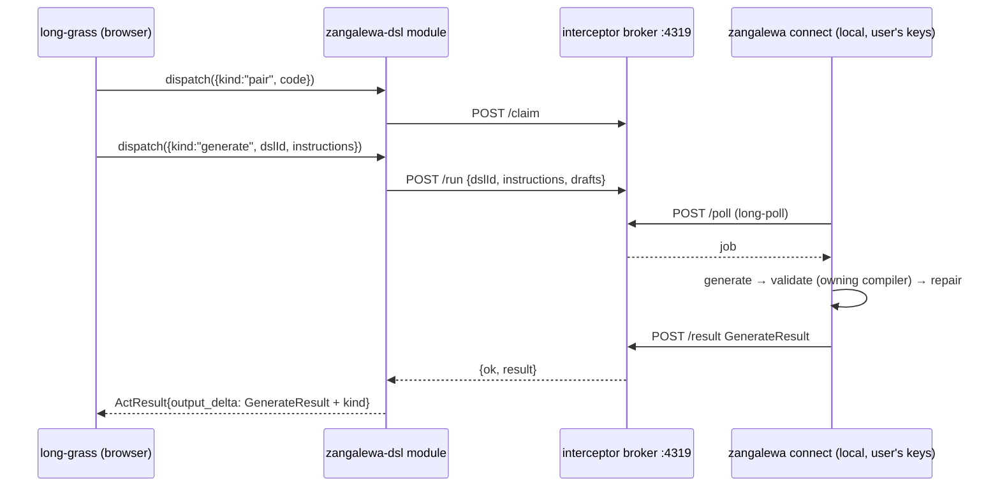

# zangalewa-dsl — natural language → DSL chunks that compile

| | |
|---|---|
| **Registry id** | `zangalewa-dsl` |
| **Layer** | generation |
| **Language** | none (it *targets* languages) |
| **Upstream** | `fullscreen-triangle/zangalewa` · `crates/zangalewa-dsl` and `interceptor/client` @ `a2f452d` |
| **Vendored at** | `buhera-os/vendor/zangalewa-dsl/src`; `long-grass/vendor/zangalewa-interceptor/client/interceptor-client.ts` |
| **Rust binding** | native: `buhera-modules/src/zangalewa.rs`, cargo feature `zangalewa` (off by default: network + heavy deps) |
| **TS binding** | remote: through the interceptor broker to the user's local `zangalewa connect` agent (`registry-ts/src/modules/zangalewa-dsl.ts`) |

## 1. Purpose

Upstream calls Zangalewa "the OS's ONLY AI module". Given `(dslId, instructions)`, it:

1. grounds a model in the language's knowledge pack;
2. generates drafts;
3. validates each draft with **the owning module's own compiler**;
4. repairs a failing draft by feeding the compiler's errors back verbatim, up to `maxRepairs`;
5. returns **every** accepted chunk.

It makes one judgement only, a syntactic one: did the compiler accept this? It does not execute, plan, route, or pick a winner among drafts.

The **interceptor** is its transport to the browser. It is a small broker on `127.0.0.1:4319` that pairs a browser session with one local agent by a single-use code, and relays opaque job payloads by long-poll. It never inspects payloads, holds no model, and makes no network egress.

## 2. Naming

long-grass also has two host-local modules whose names collide with upstream. Neither wraps upstream:

- `zangalewa` is zoom-climb's research-card coordinate extractor.
- `interceptor` is an NL → program → sandboxed run → wind-tunnel assistant.

They are left unchanged to keep their tutorials working. The upstream function is this module, `zangalewa-dsl`. long-grass's `dsl-writer` is a JavaScript re-implementation of the same loop; it is recorded as such, and its replacement by this module is **U-zng-3**.

## 3. Instructions

| Instruction | Rust | TS | Effect |
|---|---|---|---|
| `{kind:"generate", dslId, instructions, extent?, drafts?, maxRepairs?, model?, timeoutMs?}` | ✓ | ✓ | The loop. **One act-budget unit = one draft** (M6) |
| `{kind:"validate", dslId, source}` | ✓ | — | Through upstream's own DSL registry (vaHera only upstream today) |
| `"providers"` | ✓ | — | Provider availability and upstream DSL list |
| `{kind:"pair", code}` / `"status"` / `"unpair"` / `{kind:"broker", baseUrl}` | — | ✓ | Broker pairing |

## 4. Output delta

`zangalewa_generated`: upstream's `GenerateResult` verbatim, in camelCase (`{ok, dslId, extent, chunks:[{code, model, repairs, elapsedMs}], rejected:[{code, model, repairs, errors}], error?, stage?, providerErrors?}`), plus:
- `retryable`: true when `stage == "provider"`;
- `executed_on`.

`chunks` is never collapsed to one.

## 5. Residue

`rejected / (accepted + rejected)`, or 1 when nothing came back. It is **syntactic only**; it makes no claim about meaning.

## 6. Side effects

- Network calls to Ollama, OpenAI, Anthropic and Gemini, depending on which keys are configured.
- A one-time read of the knowledge packs (`ZANGALEWA_PACKS`).
- Output is nondeterministic (T ≥ 0.2).
- The TS binding makes HTTP calls to the broker. The pairing token is kept in `sessionStorage`, so it dies with the tab.

## 7. Hazards

- Gemini puts the API key in the URL query string. reqwest's error display includes the URL, so a network error could carry the key into `providerErrors[].message` (**U-zng-1**).
- `Ollama::available()` is always true, so a dead Ollama surfaces as a provider error rather than "no provider".
- Upstream's DSL registry registers vaHera only (**U-zng-2**). Generation for the other Buhera languages needs either upstream `DslEntry`s wrapping each real compiler, or a `generate_with(validator)` entry point. The Buhera DSL registry (spec 04) already holds those validators.

## 8. Conformance

- Rust: `zangalewa_validates_through_upstreams_own_registry_without_network`.
- TS: `zangalewa-dsl: an unreachable broker is a result, never a throw`.
- Catalogue C1 in both hosts.

## 9. The rest of zangalewa/crates

Five crates (`ai-integration`, `atomic-scheduler`, `task-coordinator`, `domain-bridge`, `config-manager`) are manifest-only: they have zero source files. `consciousness-core` does not compile (20 errors), and it returns constants and `todo!()`. None of them is integrated, and none should be until it has working code (M1).
